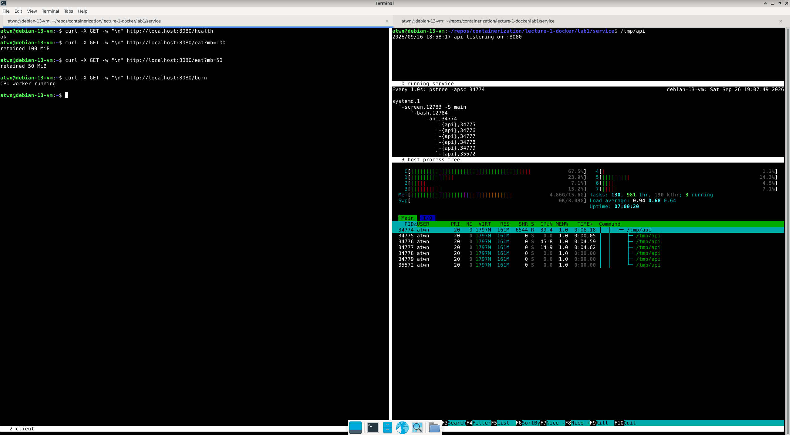

## Lab 1. Report

### Part 0

Реализован сервис на Go с тремя эндпоинтами для проверки использования ресурсов процессом, запущенным на сервере.
Более подробно о сервисе в [README.md](src/api/README.md).

#### Prerequisites
`go v1.27.1 linux/amd64` ([инструкция по установке](https://go.dev/doc/install))  

#### Сборка и запуск сервиса
```
cd ./src/api
go build -o /tmp/api .
/tmp/api
```

### Part 1

Проверили использование ресурсов http-сервером при растущей нагрузке.
Увидели PID основного процесса и его производных потоков в `htop`.
Построили дерево процессов средствами `pstree`, чтобы увидеть связь с корневым процессом `/sbin/init` (PID 1).

#### Prerequisites
**tldr** (`sudo apt-get install -y tealdeer`, `tldr --update`, `tldr tldr`)  
**curl**  (`sudo apt-get install -y curl`)  
**pstree** (`sudo apt-get install -y psmisc`, `tldr pstree`)  
**htop** (`sudo apt-get install -y htop`, [гайд](https://spin.atomicobject.com/htop-guide/))  

#### Результат


PID процесса 34774, общее потребление CPU под нагрузкой - около 100% (~1 ядро CPU, см. `CPU%`), памяти - около 161 MiB (см. `RES`).
При получении ресурсоёмких запросов, таких как `GET /eat?mb=100` и `GET /burn`, также расло количество дочерних потоков процесса.