## Lab 1. Report

### Part 0

Реализован сервис на Go с тремя эндпоинтами для проверки использования ресурсов процессом, запущенным на сервере.
Более подробно о сервисе в [README.md](src/api/README.md).

#### Сборка и запуск сервиса
```
cd ./src/api
go build -o /tmp/api .
/tmp/api
```

#### Инструменты
| Название  | Использованиe | Информация |
|:----------|:--------------|:-----------|
|`go v1.27.1 linux/amd64` | `go build -o /tmp/api .` | [инструкция](https://go.dev/doc/install)   |

### Part 1

Проверили использование ресурсов http-сервером при растущей нагрузке.
Увидели PID основного процесса и его производных потоков в `htop`.
Построили дерево процессов средствами `pstree`, чтобы увидеть связь с корневым процессом `/sbin/init` (PID 1).

#### Результат
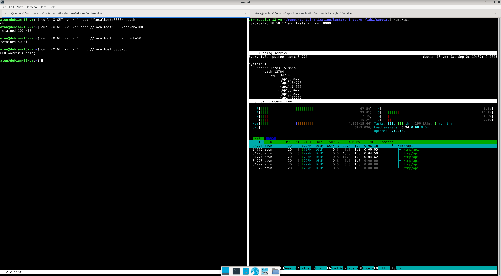<br>

Процесс /tmp/api зупущенный напрямую на хосте.

PID процесса 34774, общее потребление CPU под нагрузкой - около 100% (~1 ядро CPU, см. `CPU%`), памяти - около 161 MiB (см. `RES`).
При получении ресурсоёмких запросов, таких как `GET /eat?mb=100` и `GET /burn`, также расло количество дочерних потоков процесса.

#### Инструменты

| Название  | Использованиe | Назначение|
|:----------|:--------------|:----------|
|**pgrep**          | `pgrep -xn /tmp/api`  | определяет PID запущенного процесса по его имени (`/tmp/api`) |
|**pstree**         | `pstree -aps <pid>`   | строит дерево процесса, включая все родительские и дочерние процессы |
|**htop** [^htop]  | `htop -s PID -t -p <pid>` | отслеживаем ресурсы, используемые процессом (PID): RES - память, CPU%, Load Average - процессор |
|**curl**           | `curl -X GET http://localhost:8080/eat?mb=100` <br> `curl -X GET http://localhost:8080/burn` | дёргаем ручки |

[^htop]: [гайд](https://spin.atomicobject.com/htop-guide/) по `htop`

### Part 2

Протестировали изоляцию по каждому типу **namespace** в отдельности. Результаты представлены в таблице:

| Namespace | Инициализация | Проверка на хосте| Проверка внутри контейнера | Результат | Примечания    |
|:----------|:--------------|:-----------------|:---------------------------|:----------|:--------------|
| **pid**   | `sudo unshare --pid --fork --mount-proc bash`  | `nsenter -t $(pgrep -xn bash) --pid --mount -- ps -ef` | `ps -ef` | 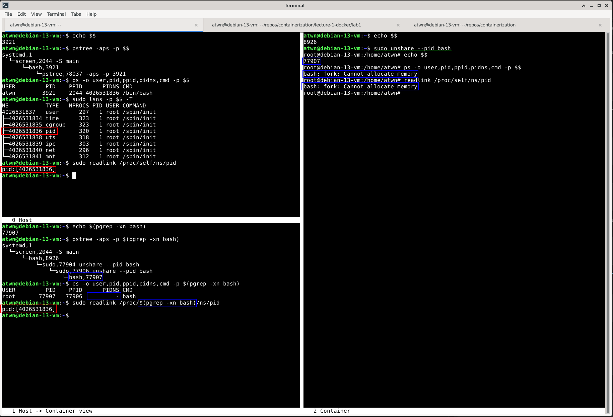 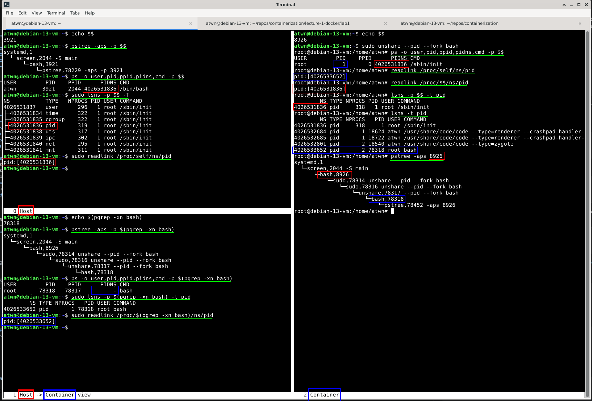 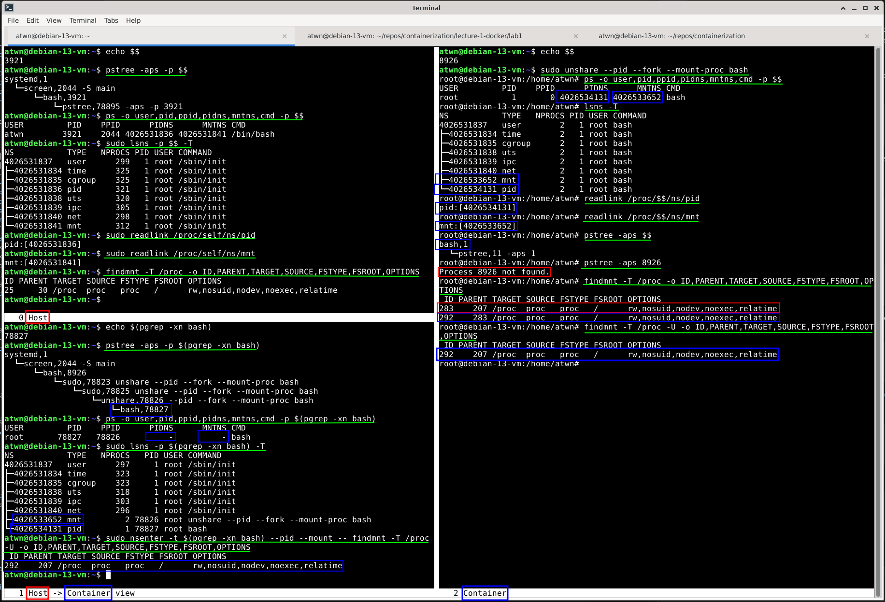 | • опция `--fork` необходима чтобы "контейнерный" процесс (`bash`) унаследовал пространства имён <br> • опция `--mount-proc` необходима чтобы смонтировать отдельный `/proc`, иначе `ps` внутри контейнера продолжит видеть внешние процессы по старому `/proc` |
| **mount** | `sudo unshare --mount --fork bash`   | `findmnt -T /mnt` | • `mount -t tmpfs tmpfs /mnt` <br> • `findmnt -T /mnt` | 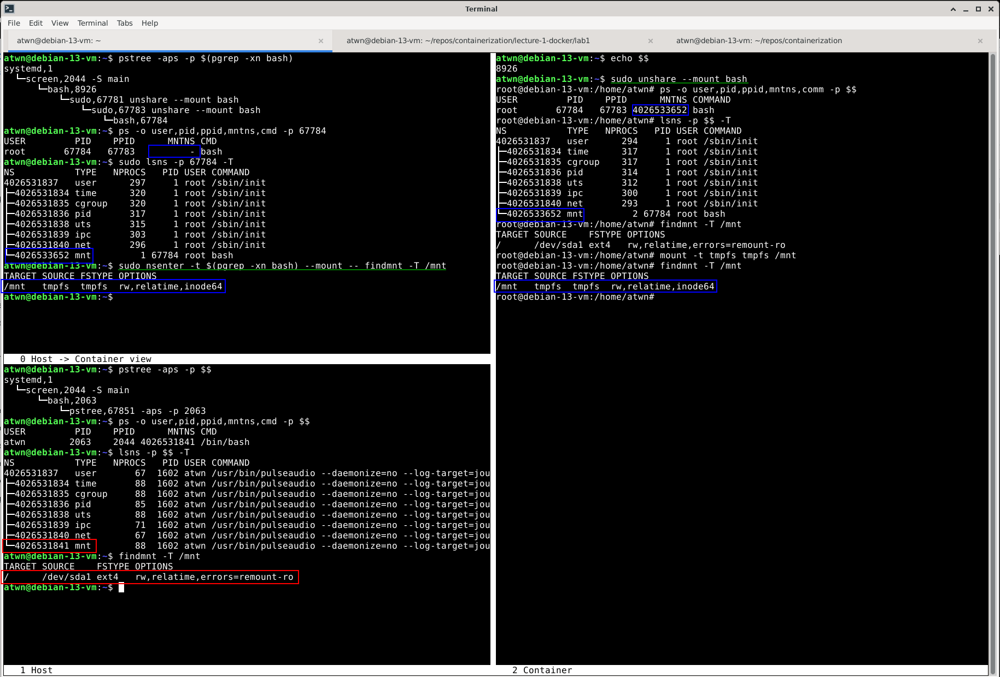 | • файловая система, смонтированная внутри контейнера, не видна на хосте |
| **net**   | `sudo unshare --net --fork bash` | `nsenter -t <host-pid> --net -- ip link` | `ip link` | 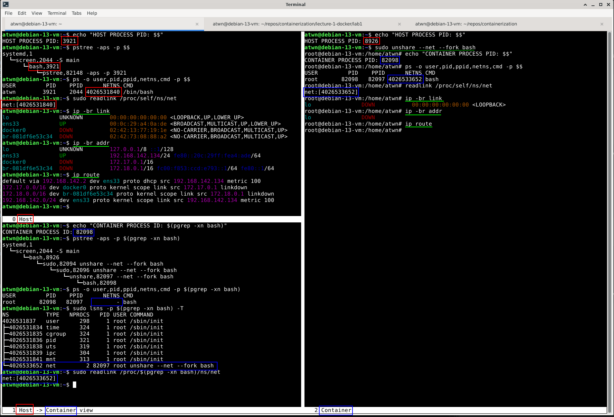 | • внутри создаётся отдельный сетевой стек; интерфейсы хоста не видны, остаётся только `lo` |
| **uts**   | `sudo unshare --uts --fork bash` | `hostname` | `hostname isolated-demo` <br> `hostname` | 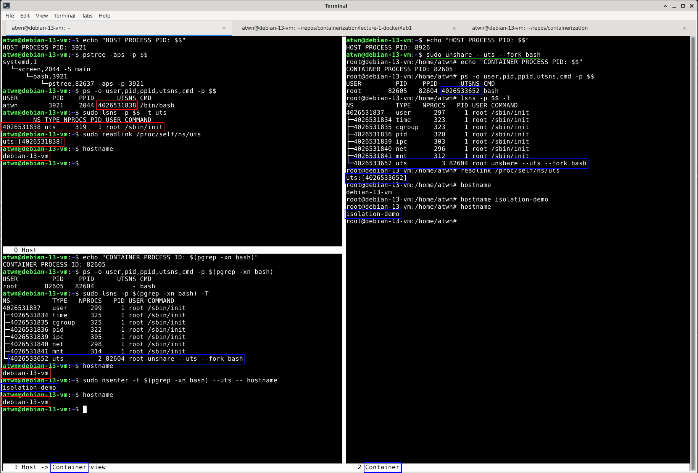 | • изменение hostname внутри контейнера не изменяет hostname хоста |
| **ipc**   | `sudo unshare --ipc --fork bash` | `ipcs -q` | `ipcmk -Q` <br> `ipcs -q` <br> `ipcrm -q <queue-id>` | 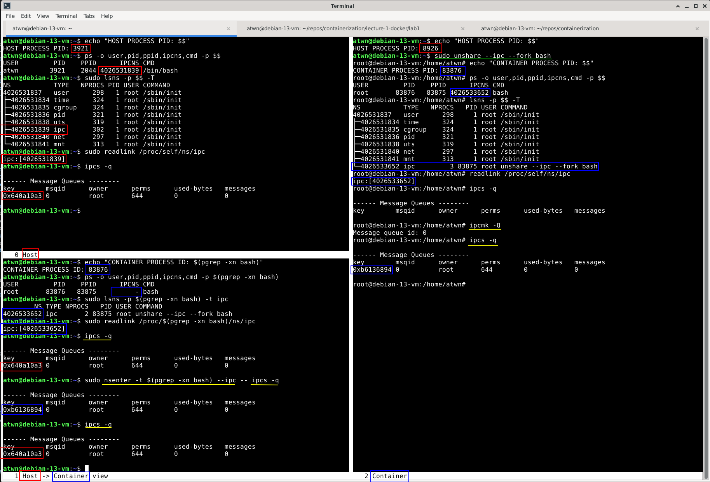 | • очереди сообщений, семафоры и разделяемая память System V изолированы от хоста |
| **user**[^userns]  | `unshare --user --map-root-user --fork bash` | `id` <br> `ps -o pid,user,uid,cmd -p <host-pid>` | `id` <br> `cat /proc/self/uid_map` | 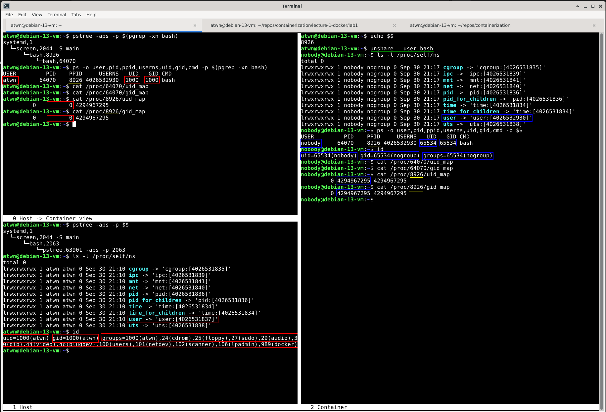 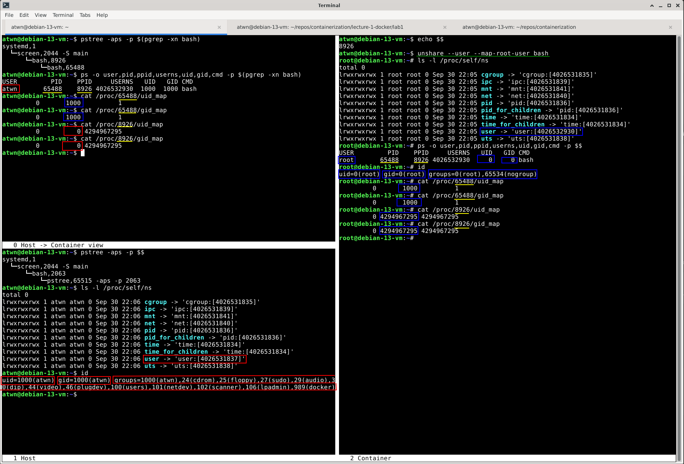 | • root внтри контейнера отображается как непривилегированный пользователь хоста <br> • `unshare --user` также изменяет маппинг родительского процесса внутри namespace, накладывая тем самым ограничения на использование пользователей хоста внутри пространства имён |

[^userns]: [статья](https://habr.com/ru/articles/459574/) на Хабре про `user` namespace

#### Результат

Объеденив все 6 пространств имён в одну команду, получаем:

| Namespace | Инициализация | Результат |
|:----------|:--------------|:----------|
| **all**[^lwn_ns]   | `unshare --pid --mount --net --uts --ipc --user --map-root-user --fork --mount-proc /tmp/api`  | 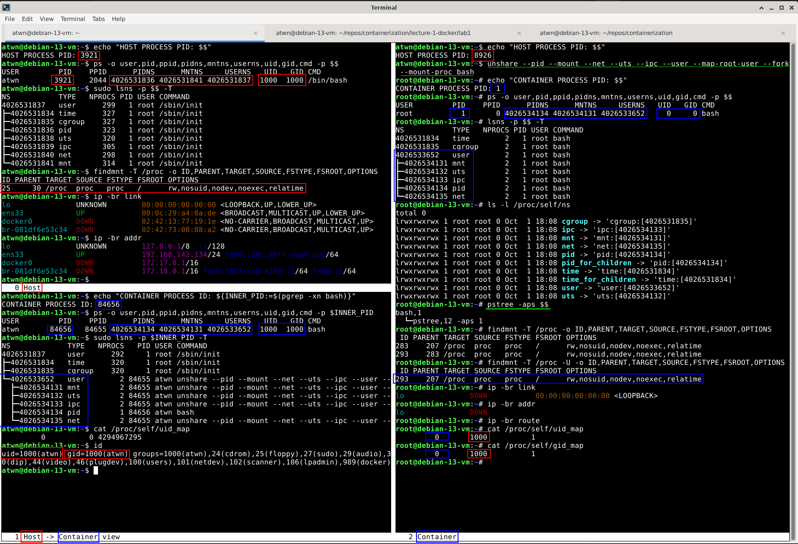 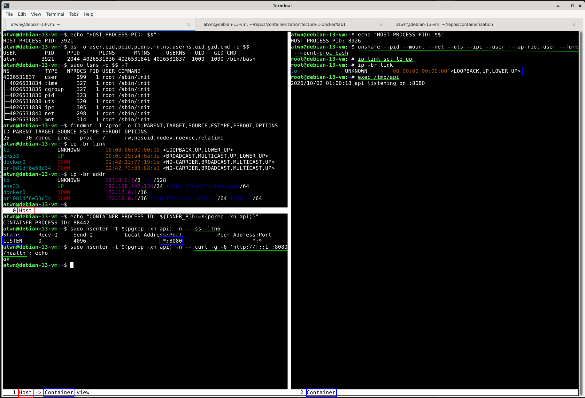 |

[^lwn_ns]: ещё одна [статья](https://lwn.net/Articles/531114/), подробно описывает все типы namespace'ов и историю их появления

#### Инструменты

| Название      | Использование | Назначение |
|:--------------|:--------------|:-----------|
| **unshare**   | `sudo unshare --pid --fork --mount-proc bash` | запускает процесс в новых пространствах имён |
| **nsenter**   | `sudo nsenter -t <host-pid> --pid --mount -- ps -ef` | выполняет команду внутри пространства имён уже запущенного процесса |
| **lsns**      | `sudo lsns -p <host-pid>` | показывает пространства имён, к которым относится процесс |
| **readlink**  | `readlink /proc/<pid>/ns/<namespace>` | показывает идентификатор пространства имён процесса, например `mnt:[4026533653]` |
| **mount**     | `mount -t tmpfs tmpfs /mnt` | монтирует файловую систему; в mount namespace монтирование может быть изолировано от хоста |
| **findmnt**   | `findmnt -T /proc` <br> `findmnt -T /mnt` | показывает, какая файловая система смонтирована по указанному пути |
| **ps**        | `ps -ef` <br> `ps -p <pid> -o user,pid,ppid,pidns,mntns,netns,args,comm --forest` | показывает процессы и их PID/namespace-характеристики |
| **hostname**  | `hostname isolated-demo` <br> `hostname` | проверяет и изменяет hostname в UTS namespace |
| **ip**        | `ip link` | показывает сетевые интерфейсы текущего network namespace |
| **ipcs**      | `ipcs -q` | показывает очереди сообщений System V в текущем IPC namespace |
| **ipcmk**     | `ipcmk -Q` | создаёт очередь сообщений System V для проверки изоляции IPC |
| **ipcrm**     | `ipcrm -q <queue-id>` | удаляет созданную очередь сообщений после проверки |
| **id**        | `id` | показывает UID/GID процесса |
| **uid_map**   | `cat /proc/<pid>/uid_map` | показывает маппинг пользователей в user namespace; возвращает разное значение в зависимости от того, какой процесс запрашивает |


### Part 3

Провели эксперименты с назначением лимитов по памяти, CPU и количеству процессов посредством инструментов `cgroup`. Результаты свели в таблицу:

| Шаг           | Инициализация | Проверка | Результат | Примечания    |
|:--------------|:--------------|:---------|:----------|:--------------|
| **Memory**    | `/sys/fs/cgroup/<cg_name>/cgroup.procs` <br> `/sys/fs/cgroup/<cg_name>/memory.max` <br> `/sys/fs/cgroup/<cg_name>/memory.swap.max` | `/sys/fs/cgroup/<cg_name>/memory.events` <br> └─`oom` <br> └─`oom_killed` | 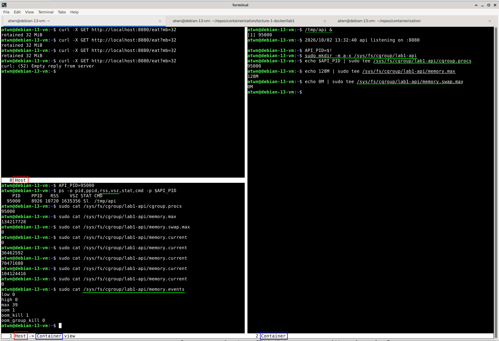 | • важно установить лимит на `swap`, потому что если этот механизм будет задействован, процесс продолжит наращивать виртуальную память, и не перевалит за установленный `memory.max` лимит пока всё адресное пространство виртуальной памяти не будет исчерпано |
| **CPU**       | `/sys/fs/cgroup/<cg_name>/cgroup.procs` <br> `/sys/fs/cgroup/<cg_name>/cpu.max` | `/sys/fs/cgroup/<cg_name>/cpu.stat` <br> └─`nr_throttled` <br> └─`throttled_usec` | 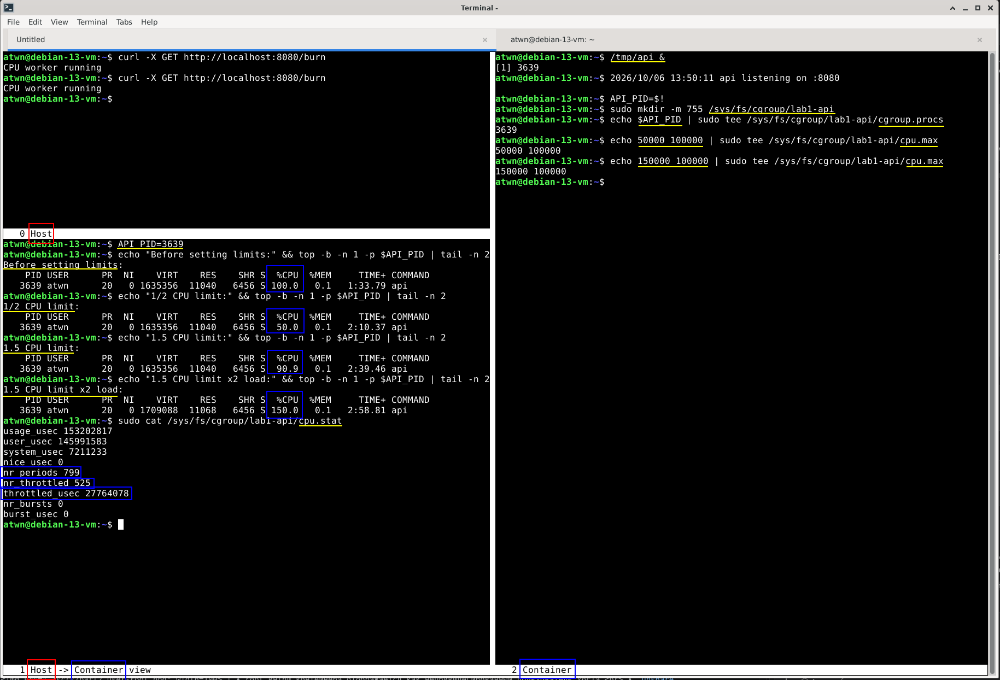 | • лимит по CPU устанавливается при помощи двух чисел: <количество доступных мс за интервал> <длина интервала в мс> <br> • причём, первое число может превышать длину интервала, что означает разрешение использовать нескольких ядер CPU данной группе |
| **PIDs**  | `/sys/fs/cgroup/<cg_name>/cgroup.procs` <br> `/sys/fs/cgroup/<cg_name>/pids.max` | `/sys/fs/cgroup/<cg_name>/pids.current` <br> `/sys/fs/cgroup/<cg_name>/pids.events` | 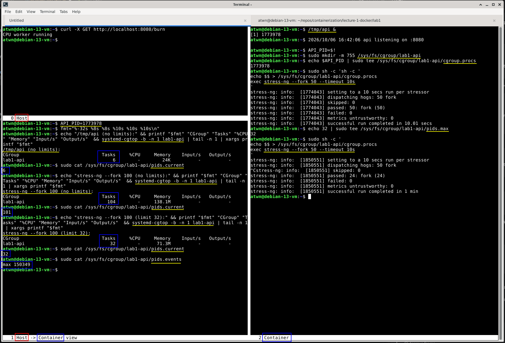 | • под "процессами" (pids) здесь, на самом деле понимается количество потоков (Tasks), а не процессов (Proc)  |

#### Инструменты

| Название          | Использование | Назначение |
|:------------------|:--------------|:-----------|
| **top**           | `top -b -n 1 -p <pid> \| tail -n 2`   | показывает актуальную загрузку CPU процессом "в моменте" |
| **systemd-cgtop** | `systemd-cgtop -b -n 1 <cgroup-name>` | показывает использование ресурсов группами процессов |
| **stress-ng**     | `stress-ng --fork 50 --timeout 10s`   | поддерживает заданное число запущенных одновременно процессов (использует системный вызов fork(), который возвращает EAGAIN когда упирается в лимит pids.max) |

### Part 4

Рассмотрели два механизма ядра Linux, используемые для разграничения доступа.

| Шаг               | Инициализация | Проверка | Демонстрация   | Примечания    |
|:------------------|:--------------|:---------|:---------------|:--------------|
| **capabilities**[^cap]  | `capsh --drop=<capability-name> -c <unprivileged-command>` | `grep -E "^(Cap\|NoNewPrivs):" /proc/$$/status` <br> └─`CapEff` - применяются сейчас <br> └─`CapPrm` - потенциально допустимые <br> └─`CapBnd` - доступные дочернему процессу <br> `capsh --print` | 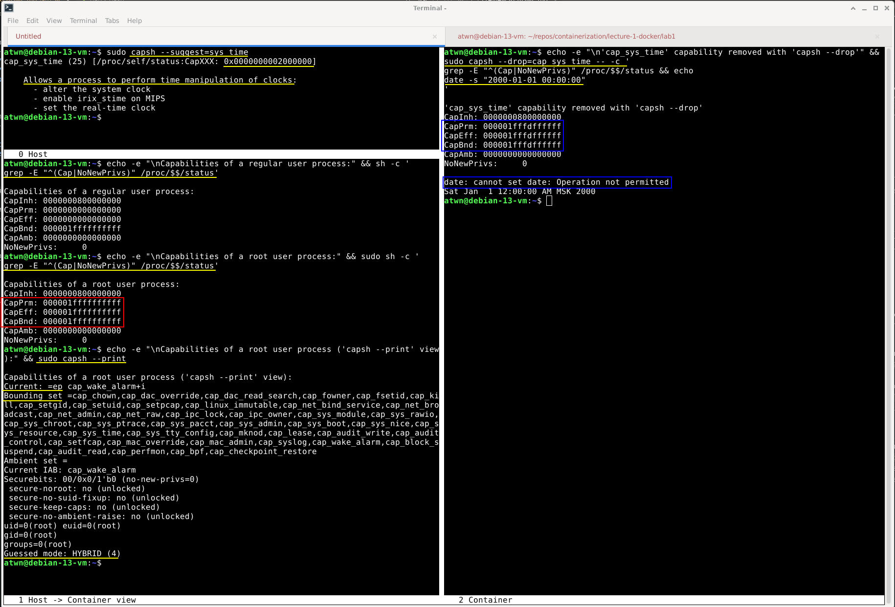 | • библиотека **libcap** (`apt-cache show libcap2-bin`) <br> • ограничения задаются при инициализации дочернего процесса, путём *исключения* `capabilities` из списка эффективных возможностей родительского процесса |
| **seccomp**       | `sudo systemd-run --wait --pipe --collect --property='SystemCallFilter=~mkdir mkdirat' --property=SystemCallErrorNumber=EPERM /usr/bin/strace -f -e trace=mkdir,mkdirat /usr/bin/mkdir /tmp/seccomp-demo` | `strace -f -e trace=mkdir,mkdirat` <br> └─ ожидается `mkdirat(...) = -1 EPERM` | 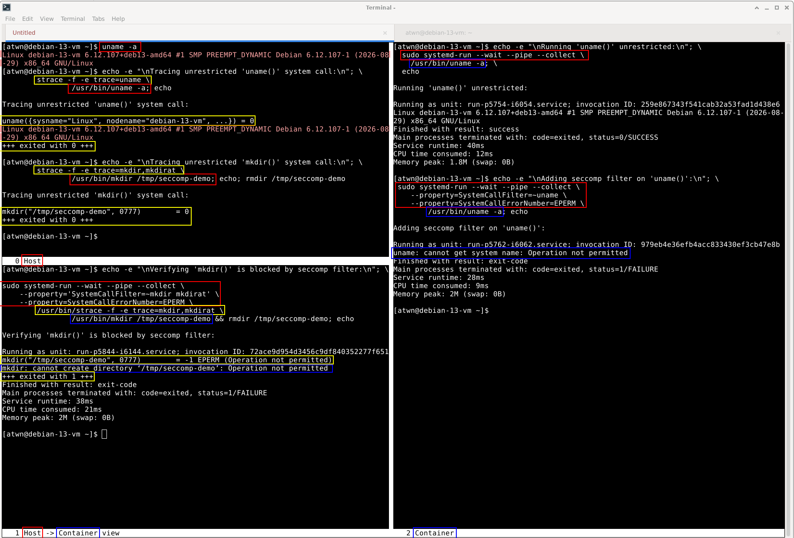 | • библиотека **libseccomp** (`apt-cache show libseccomp-dev`) <br> • применяется для фильтрации системных вызовов <br> • для демонстрации выбраны `mkdir`/`mkdirat`, а не `uname`: `strace` сам вызывает `uname` при запуске, поэтому фильтрация `uname` не позволяла трассировщику стартовать и скрывала результат фильтра |

[^cap]: [статья](https://habr.com/ru/articles/1075296/) на Хабре про `capabilities`

#### Инструменты

| Название                  | Использование | Назначение |
|:--------------------------|:--------------|:-----------|
| **capsh**                 | `capsh --drop=<capability-name> -c <unprivileged-command>` | позволяет запустить процесс с заданными `capapbilities`-ограничениями |
| **systemd-run**           | `systemd-run --wait --pipe --collect <program>`   | запускает программу в ограниченном контексте (**transient scope**) или сервисе (**transient service**), с возможностью выставить cgroup'ы и seccomp-фильтры |
| **strace**                | `strace -f -e trace=<syscall-name> <program>` | позволяет отслеживать системные вызовы произвольной программы без необходимости доступа к её исходному коду |

### Part 5

Собрали запуск сервиса из механизмов, проверенных в предыдущих частях: namespaces, cgroups и ограничения привилегий.

Для управления cgroup создаём transient service при помощи `systemd-run`, а namespaces создаём при помощи `unshare`.

Параметры `systemd-run` соответствуют контроллерам cgroup v2, рассмотренным в [Part 4](#part-4).

| Limit         | Параметр systemd  | Файл cgroup v2 |
|:--------------|:------------------|:---------------|
| Память        | `MemoryMax=128M`  | `memory.max`   |
| Swap          | `MemorySwapMax=0` | `memory.swap.max` |
| CPU           | `CPUQuota=50%` | `cpu.max` |
| Количество tasks | `TasksMax=64` | `pids.max` |

Поскольку API находится в отдельном network namespace, запрос выполняли из внешнего процесса, вошедшего только в его network namespace.
`curl` остаётся обычным host-процессом, но использует сетевой стек API. Поэтому для проверки не требовались `veth`, bridge и маршрутизация.

| Шаг | Запуск | Проверка | Демонстрация | Наблюдения |
|:----|:-------|:---------|:-------------|:-----------|
| **1. `systemd-run` <br>+ `unshare`** | `./scripts/mydocker.sh start`<br><br>Внутри скрипта: `systemd-run` запускает `unshare` с PID, mount, network, UTS, IPC и user namespaces | `systemctl show lab1-api`<br>`lsns -p <api-pid>`<br>`nsenter -t <api-pid> --net -- curl http://localhost:8080/health` | 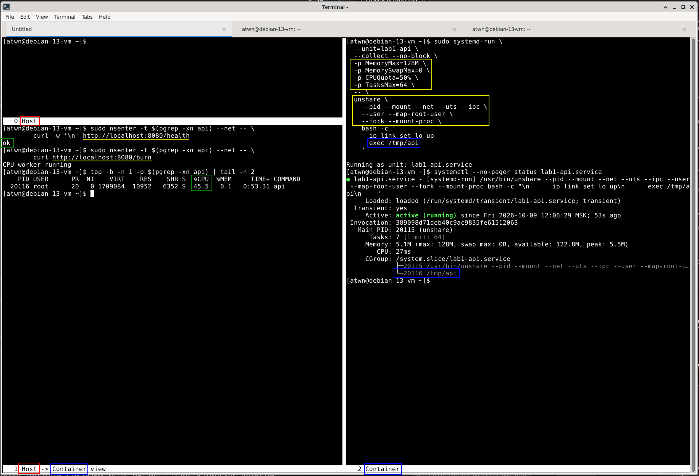 | • cgroup transient service наследуется `unshare` и `/tmp/api`<br>• host-side `localhost` не видит сервис в отдельном network namespace |
| **2. + `capabilities`** | systemd-run задаёт `NoNewPrivileges=yes`, после чего внутри user namespace выполняется `capsh --drop=cap_sys_time` перед `exec /tmp/api` | `grep -E "^(Cap\|NoNewPrivs):" /proc/<api-pid>/status`<br>`CapPrm`, `CapEff`, `CapBnd` | 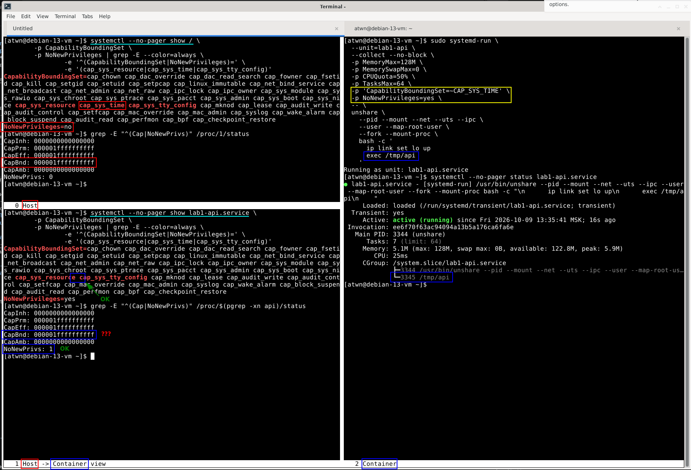 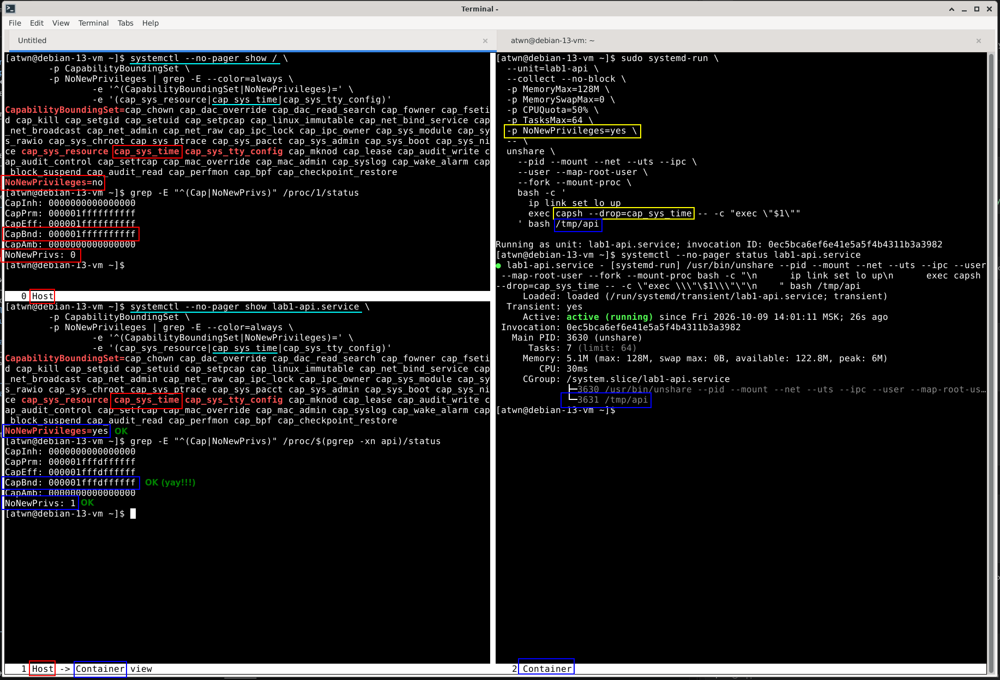 | • ограничение capabilities до создания user namespace не дало ожидаемого результата для `/tmp/api`<br>• новый user namespace получил собственный набор capabilities<br>• drop выполняется внутри user namespace |
| **3. + `seccomp`** | systemd-run с `SystemCallFilter=~mkdir mkdirat` и `SystemCallErrorNumber=EPERM` | `strace -f -e trace=mkdir,mkdirat`<br>ожидается `mkdirat(...) = -1 EPERM` | 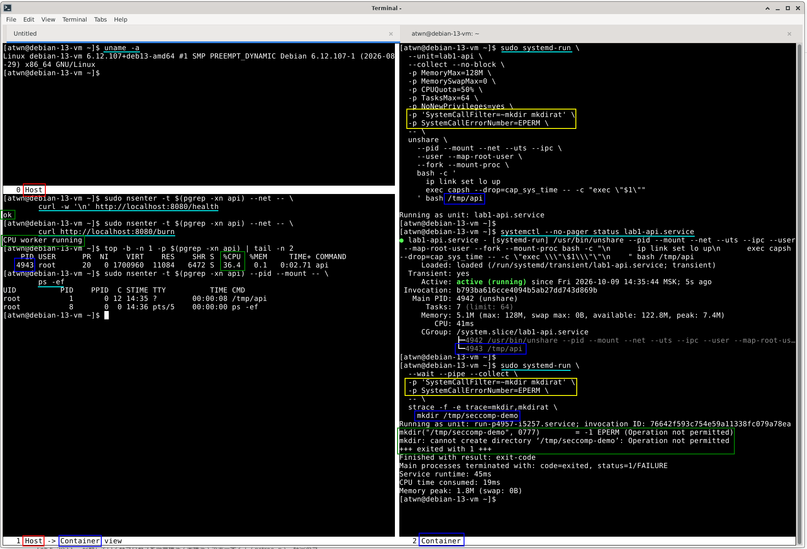 | • seccomp фильтрует системные вызовы<br>• `mkdir` выбран вместо `uname`, потому что `strace` сам использует `uname` при запуске |

Вышеописанные шаги и команды сведены в единый [скрипт](./scripts/mydocker.sh), имитирующий поведение `docker run`. Для запуска, выполните (необходимы права sudo на хосте и скомпилированное приложение):

```bash
./scripts/mydocker.sh start
./scripts/mydocker.sh status
./scripts/mydocker.sh stop
```

#### Выводы:

- использование `systemd-run` позволило нам более эффективно управлять cgroup и жизненным циклом просесса
- сначала создаётся transient service с cgroup-лимитами, а затем внутри него запускаются namespaces: дочерние процессы автоматически наследуют cgroup, тогда как root внутри user namespace обычно не может управлять cgroup хоста;
- ограничение capabilities, заданное до создания `user` namespace, не гарантирует тот же набор ограничений для процесса внутри namespace: после создания user namespace процесс получает capabilities в своём namespace. Поэтому `capsh --drop=cap_sys_time` нужно выполнять внутри user namespace, перед `exec /tmp/api`;
- `MemorySwapMax=0` исключает уход памяти в swap во время эксперимента;
- host-side `curl localhost:8080` не видит API в отдельном network namespace; для проверки используется `nsenter --net`.

#### Сравнение с `docker run`

Запуск через `systemd-run` + `unshare` показывает базовые механизмы контейнера непосредственно на уровне ядра.
Docker автоматизирует их настройку и дополнительно предоставляет:

- готовую файловую систему контейнера из image;
- управление жизненным циклом и именами контейнеров;
- сетевое подключение через `veth` и bridge;
- готовые профили capabilities и seccomp;
- более удобную настройку volumes, портов, логирования и restart policy.

Текущая реализация использует host filesystem и требует ручной настройки namespace и проверки сетевого namespace;
это основные отличия от полноценного `docker run`.

#### Инструменты

| Название | Использование | Назначение |
|:---------|:--------------|:-----------|
| **systemd-run** | `systemd-run --unit=lab1-api --collect --no-block <program>` | • создаёт transient service и запускает программу в отдельном cgroup<br>• через параметры unit позволяет задать лимиты ресурсов, `NoNewPrivileges` и seccomp-фильтры |
| **systemctl** | `systemctl status lab1-api` <br> `systemctl stop lab1-api` | • показывает параметры и состояние transient service<br>• управляет его жизненным циклом |

### Part 6

Собрали multi-stage Dockerfile (см. [./src/api/Dockerfile](./src/api/Dockerfile)) для docker на основе `scratch`.
Изучили механизм переиспользования слоёв и сравнили структуру multi-stage образа с его single-stage аналогом.
Также провели исследование namespaces, cgroups и capabilities процесса, запущенного в docker-контейнере.
В завершение, поэкспериментировали с эфемерной файловой системой контейнера и подключили volume.
Выводы представлены ниже в таблице.

| Шаг | Инициализация | Проверка | Демонстрация | Наблюдения |
|:----|:--------------|:---------|:-------------|:-----------|
| **1. Кэширование слоёв, размер образа** | `docker build -t lab1-api:multi ./src/api` | `docker image inspect lab1-api:multi --format '{{.Size}} bytes'`<br>`docker history lab1-api:multi` | 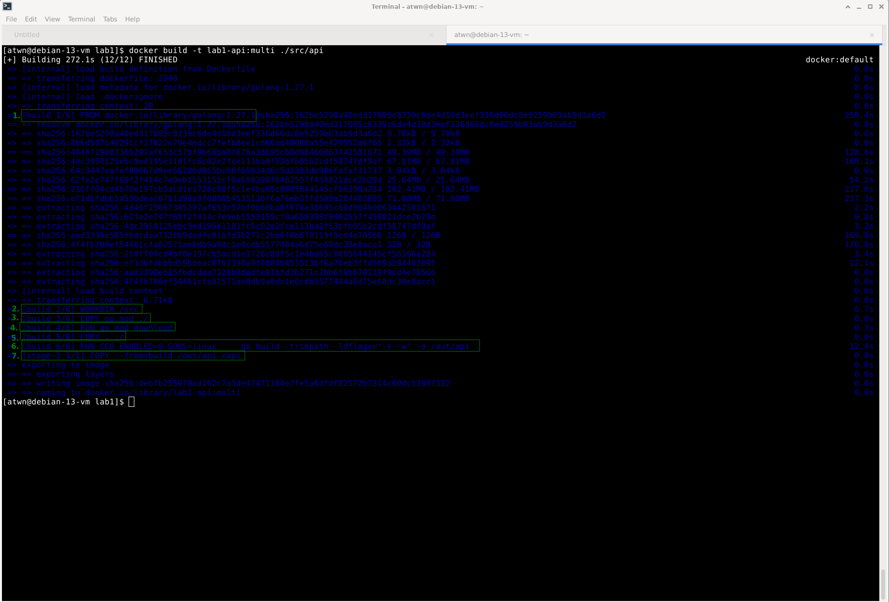 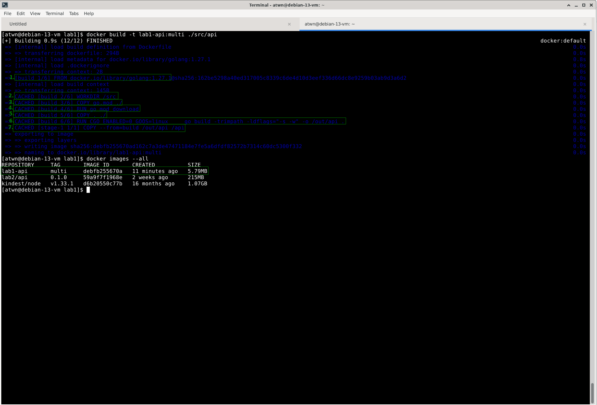 | • builder-слои переиспользуются при повторной сборке (`CACHED`)<br>• `go mod download` находится в отдельном cacheable layer<br>• в итоговый образ попадает только бинарный файл и metadata runtime-слоёв, а Go toolchain отбрасывается |
| **2. Сравнение multi-stage с single-stage** | `docker build -f ./src/api/Dockerfile.single -t lab1-api:single ./src/api` | `docker image inspect lab1-api:single lab1-api:multi --format '{{.RepoTags}}: {{.Size}} bytes'`<br>`docker history lab1-api:single`<br>`docker history lab1-api:multi` | 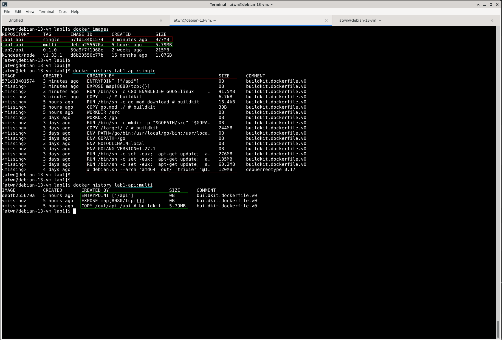 | • multi-stage образ существенно меньше, потому что не содержит Go toolchain и build environment<br>• single-stage образ содержит инструменты, библиотеки и файлы, нужные только для сборки<br>• multi-stage уменьшает runtime attack surface и объём передаваемых данных |
