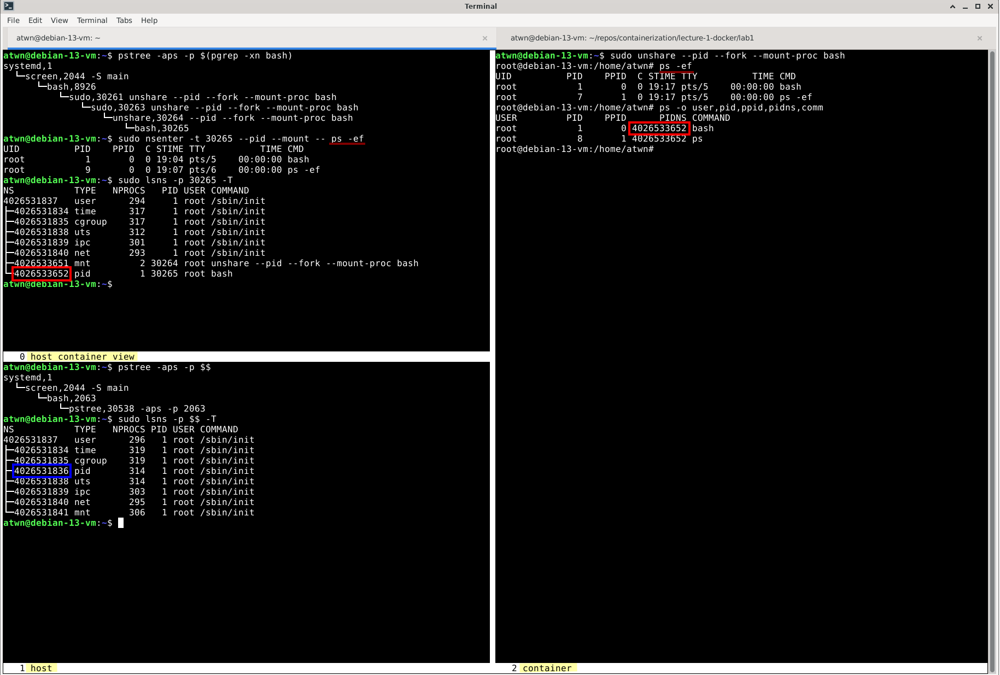
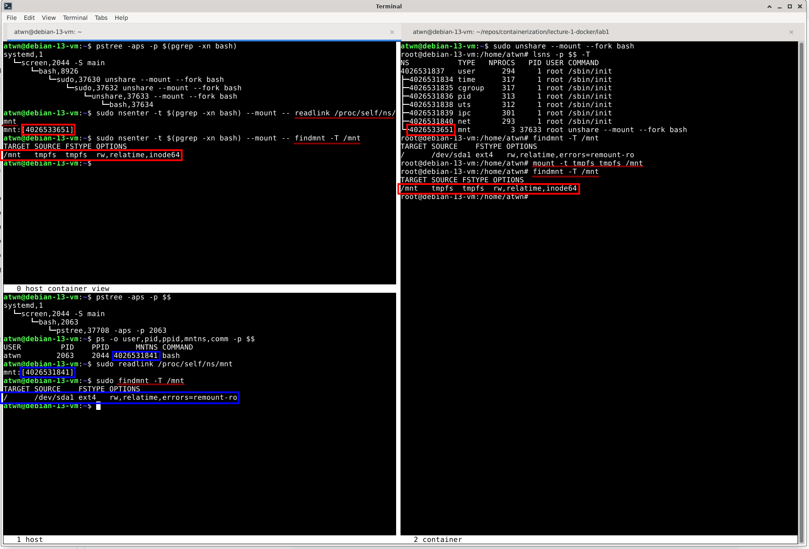

## Lab 1. Report

### Part 0

Реализован сервис на Go с тремя эндпоинтами для проверки использования ресурсов процессом, запущенным на сервере.
Более подробно о сервисе в [README.md](src/api/README.md).

#### Инструменты
| Название  | Установка | Справка   |
|:----------|:----------|:----------|
|`go v1.27.1 linux/amd64` | [инструкция](https://go.dev/doc/install)   | |

#### Сборка и запуск сервиса
```
cd ./src/api
go build -o /tmp/api .
/tmp/api
```

### Part 1

Проверили использование ресурсов http-сервером при растущей нагрузке.
Увидели PID основного процесса и его производных потоков в `htop`.
Построили дерево процессов средствами `pstree`, чтобы увидеть связь с корневым процессом `/sbin/init` (PID 1).

#### Инструменты

| Название  | Использованиe | Назначение|
|:----------|:--------------|:----------|
|**pgrep**          | `pgrep -xn /tmp/api`  | определяет PID запущенного процесса по его имени (`/tmp/api`) |
|**pstree**         | `pstree -aps <pid>`   | строит дерево процесса, включая все родительские и дочерние процессы |
|**htop** [^htop1]  | `htop -s PID -t -p <pid>` | отслеживаем ресурсы, используемые процессом (PID): RES - память, CPU%, Load Average - процессор |
|**curl**           | `curl -X GET http://localhost:8080/eat?mb=100` <br> `curl -X GET http://localhost:8080/burn` | дёргаем ручки |

[^htop1]: [гайд](https://spin.atomicobject.com/htop-guide/) по `htop`

#### Результат


Процесс /tmp/api зупущенный напрямую на хосте.

PID процесса 34774, общее потребление CPU под нагрузкой - около 100% (~1 ядро CPU, см. `CPU%`), памяти - около 161 MiB (см. `RES`).
При получении ресурсоёмких запросов, таких как `GET /eat?mb=100` и `GET /burn`, также расло количество дочерних потоков процесса.

### Part 2

Протестировали изоляцию по каждому типу **namespace** в отдельности. Результаты представлены в таблице:

| Namespace | Инициализация | Проверка на хосте| Проверка внутри контейнера | Результат | Примечания    |
|:----------|:--------------|:-----------------|:---------------------------|:----------|:--------------|
| **pid**   | `unshare --pid --fork --mount-proc bash`  | `nsenter -t $(pgrep -xn bash) --pid --mount -- ps -ef` | `ps -ef` |  | • опция `--fork` необходима чтобы "контейнерный" процесс (`bash`) унаследовал пространства имён <br> • опция `--mount-proc` необходима чтобы смонтировать отдельный `/proc`, иначе `ps` внутри контейнера продолжит видеть внешние процессы по старому `/proc` |
| **mount** | `unshare --mount --fork bash`   | `findmnt -T /mnt` | • `mount -t tmpfs tmpfs /mnt` <br> • `findmnt -T /mnt` |  | • файловая система, смонтированная внутри контейнера, не видна на хосте |
| **net**   | `unshare --net --fork bash` | `nsenter -t <host-pid> --net -- ip link` | `ip link` |  | • внутри создаётся отдельный сетевой стек; интерфейсы хоста не видны, обычно остаётся только `lo` |
| **uts**   | `unshare --uts --fork bash` | `hostname` | `hostname isolated-demo` <br> `hostname` |  | • изменение hostname внутри контейнера не изменяет hostname хоста |
| **ipc**   | `unshare --ipc --fork bash` | `ipcs -q` | `ipcmk -Q` <br> `ipcs -q` <br> `ipcrm -q <queue-id>` |  | • очереди сообщений, семафоры и разделяемая память System V изолированы от хоста |
| **user**[^userns]  | `unshare --user --map-root-user --fork bash` | `id` <br> `ps -o pid,user,uid,cmd -p <host-pid>` | `id` <br> `cat /proc/self/uid_map` |  | • root внутри контейнера отображается как непривилегированный пользователь хоста |

[^userns]: [статья](https://habr.com/ru/articles/459574/) на Хабре про User namespace

#### Инструменты

| Название      | Использование | Назначение |
|:--------------|:--------------|:-----------|
| **unshare**   | `sudo unshare --pid --fork --mount-proc bash` | запускает процесс в новых пространствах имён |
| **nsenter**   | `sudo nsenter -t <host-pid> --pid --mount -- ps -ef` | выполняет команду внутри пространства имён уже запущенного процесса |
| **lsns**      | `sudo lsns -p <host-pid>` | показывает пространства имён, к которым относится процесс |
| **readlink**  | `readlink /proc/<pid>/ns/<namespace>` | показывает идентификатор пространства имён процесса, например `mnt:[4026533653]` |
| **mount**     | `mount -t tmpfs tmpfs /mnt` | монтирует файловую систему; в mount namespace монтирование может быть изолировано от хоста |
| **findmnt**   | `findmnt -T /proc` <br> `findmnt -T /mnt` | показывает, какая файловая система смонтирована по указанному пути |
| **ps**        | `ps -ef` <br> `ps -p <pid> -o user,pid,ppid,pidns,mntns,netns,args,comm --forest` | показывает процессы и их PID/namespace-характеристики |
| **hostname**  | `hostname isolated-demo` <br> `hostname` | проверяет и изменяет hostname в UTS namespace |
| **ip**        | `ip link` | показывает сетевые интерфейсы текущего network namespace |
| **ipcs**      | `ipcs -q` | показывает очереди сообщений System V в текущем IPC namespace |
| **ipcmk**     | `ipcmk -Q` | создаёт очередь сообщений System V для проверки изоляции IPC |
| **ipcrm**     | `ipcrm -q <queue-id>` | удаляет созданную очередь сообщений после проверки |
| **id**        | `id` <br> `cat /proc/self/uid_map` | показывает UID/GID процесса и отображение пользователей в user namespace |

#### Результат
Объеденив все 6 пространств имён в одну команду, получаем:
| Namespaces| Инициализация | Результат |
|:----------|:--------------|:----------|
| **all**   | `unshare --pid --mount --net --uts --ipc --user --map-root-user --fork --mount-proc /tmp/api`  | |
