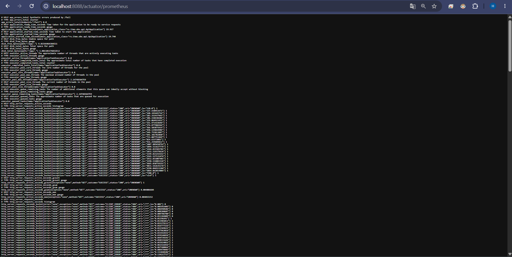
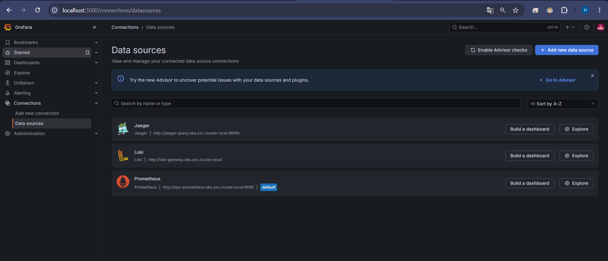
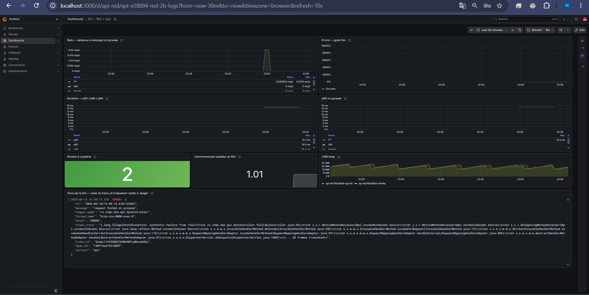
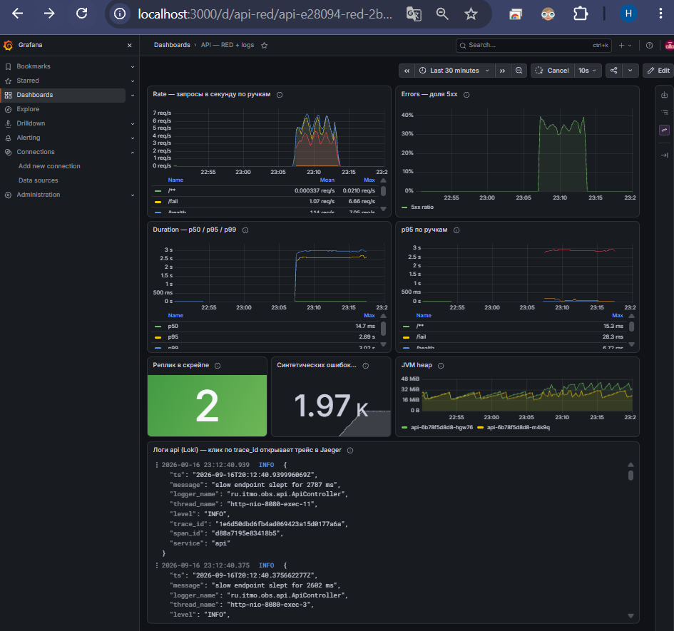
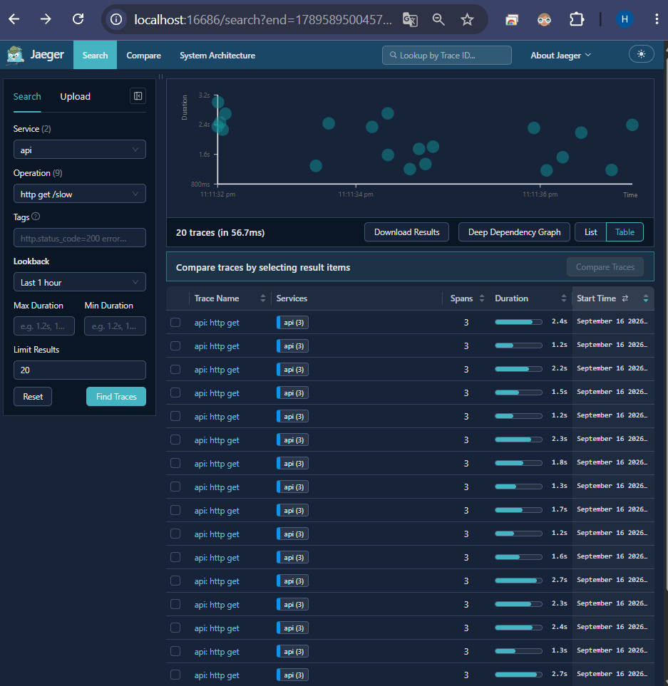
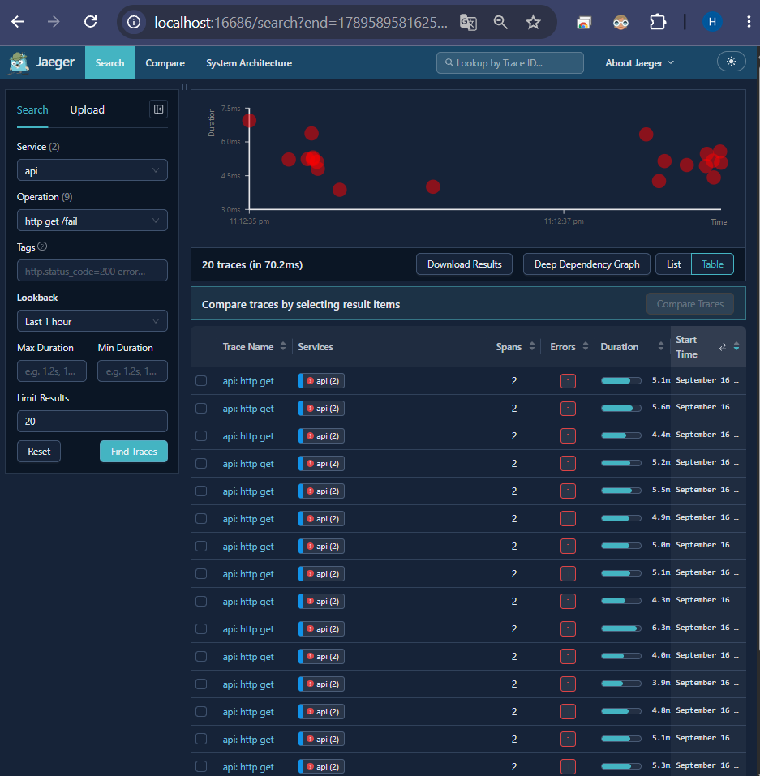
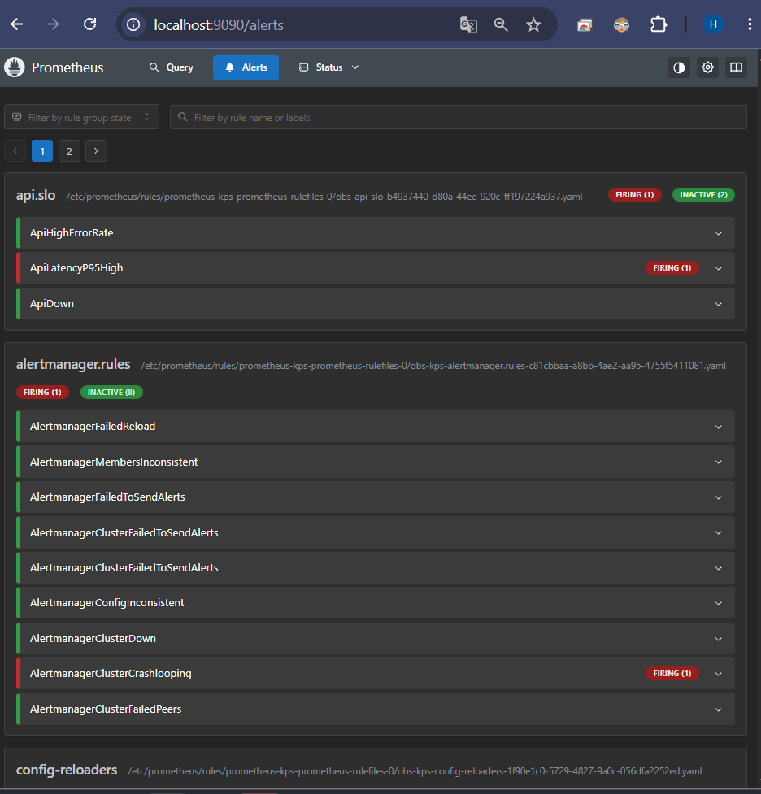
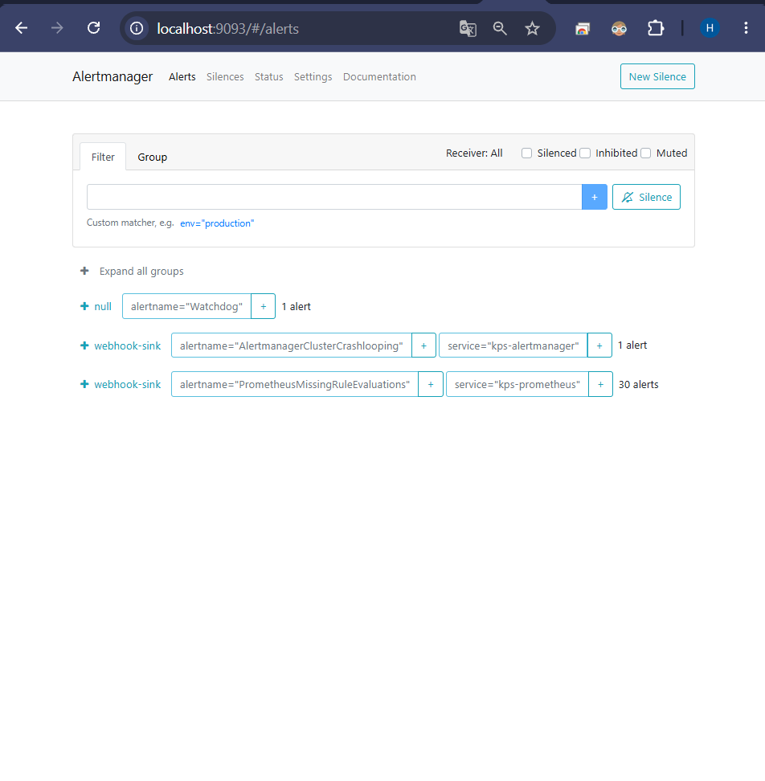
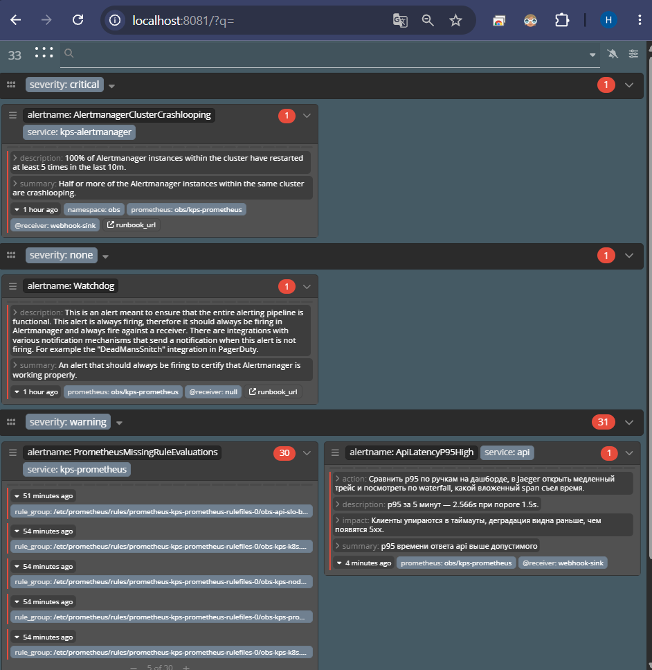
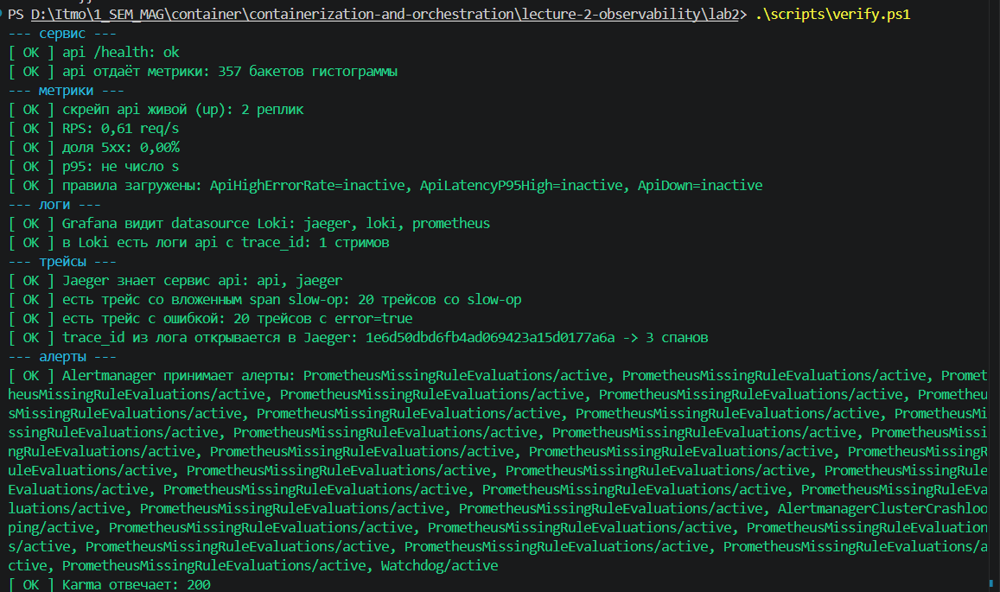

# Лаба 2 — мониторинг сервиса: метрики, логи, трейсы

Сервис на Java 17 / Spring Boot, всё остальное — в Kubernetes, ставится Helm'ом.
Сам сервис простой, вся работа в обвязке вокруг него.

```
api (Spring Boot)
 ├─ /actuator/prometheus ──scrape──> Prometheus ──> Grafana (RED-дашборд)
 │                                      └──rules──> Alertmanager ──> вебхук
 │                                                        └────────> Karma
 ├─ stdout (JSON + trace_id) ──Alloy──> Loki ──> Grafana (логи)
 └─ OTLP ───────────────────────────────────> Jaeger (трейсы)
```

## Стенд

| | |
|---|---|
| Хост | Windows 11, Docker Desktop (WSL2) |
| Кластер | kind, Kubernetes 1.33.1, 2 узла |
| Helm | 4.3.0 |
| Сервис | Java 17, Spring Boot 3.5.5, Maven |

Взял kind, а не minikube: он поднимает узлы обычными контейнерами в уже запущенном Docker, отдельная
виртуалка не нужна. Образ сервиса заезжает внутрь через `kind load docker-image`, так что реестр тоже не нужен.

Версия Kubernetes зафиксирована на 1.33.1 не просто так. По умолчанию kind тянет 1.37, и кластер не
поднимался — kubelet падал с `kubelet is configured to not run on a host using cgroup v1`.
У Docker Desktop на этой машине `docker info` показывает `CgroupVersion: 1`, а 1.37 на cgroup v1 работать
отказывается. Можно было переключить весь WSL2 на cgroup v2 через `.wslconfig`, но это трогает всю машину
ради одной лабы, поэтому просто взял версию, которая с cgroup v1 работает. Пин лежит в `deploy/kind-cluster.yaml`.

## Предварительные требования

Стенд можно собрать как на WSL2, так и на обычном Linux. Исходили из той конфигурации,
которая была доступна у членов команды, работающих над лабой.

### Для запуска на WSL2 (с дистрибутивом Debian 13)
#### на хосте (Windows):
1. Включить компонент "Подсистема Windows для Linux" на хосте
1. Скачать и установить образ Debian  
   `wsl --install Debian`  
1. Установить Docker Desktop для Windows на хосте
   ([инструкция](https://docs.docker.com/desktop/setup/install/windows-install/))
   и включить интеграцию с WSL для нового образа в настройках Docker Desktop

#### внутри дистрибутива (Debian 13 в WSL2):
1. Установить kind и kubectl  
   `sudo apt-get install -y kind kubectl`  
1. Установить Helm ([интсрукция](https://helm.sh/docs/intro/install/#from-apt-debianubuntu))
1. Установить PowerShell ([инструкция](https://learn.microsoft.com/en-us/powershell/scripting/install/install-debian?view=powershell-7.6))

### Для запуска на Debian 13
1. Установить Docker Engine ([инструкция](https://docs.docker.com/engine/install/debian/))
1. Установить kind и kubectl  
   `sudo apt-get install -y kind kubectl`  
1. Установить Helm ([интсрукция](https://helm.sh/docs/intro/install/#from-apt-debianubuntu))
1. Установить PowerShell ([инструкция](https://learn.microsoft.com/en-us/powershell/scripting/install/install-debian?view=powershell-7.6))

## Запуск

```powershell
.\scripts\up.ps1             # кластер, образ, весь стек
.\scripts\port-forward.ps1   # проброс UI на localhost
.\scripts\load.ps1 -Minutes 6 -Fail 0.35 -Slow 0.25   # нагрузка
.\scripts\verify.ps1         # проверка, что всё сошлось
.\scripts\down.ps1           # снести
```

| Компонент | URL |
|---|---|
| Grafana | http://localhost:3000 (admin / admin) |
| Prometheus | http://localhost:9090 |
| Alertmanager | http://localhost:9093 |
| Jaeger | http://localhost:16686 |
| Karma | http://localhost:8081 |
| api | http://localhost:8088 |

## Часть 0 — сервис

Четыре ручки: `/health`, `/fail` (500 + счётчик ошибок), `/slow` (сон 1–3 секунды),
`/load` (обстреливает сам себя, чтобы поднять RPS).

`/load` бьёт не в localhost, а через Service — `http://api.obs.svc.cluster.local:8080`. Так нагрузка
расходится на обе реплики, а не валится на ту, что приняла запрос. Доли `/fail` и `/slow` задаются
параметрами запроса: с фиксированными значениями алерт с порогом 5% руками не разогреть.

Метрики отдаёт Micrometer в формате Prometheus. Счётчик запросов и гистограмма времени ответа идут
из коробки, для `/fail` добавил свой счётчик `app_errors_total`.



Важный момент в конфиге — `percentiles-histogram: true`, то есть наружу идут бакеты гистограммы, а не
готовые персентили. Готовые персентили считаются внутри JVM отдельно в каждой реплике, и сложить их между
подами нельзя. Бакеты сложить можно, поэтому p95 считается запросом в PromQL.

Логи — JSON, в каждой строке запроса есть `trace_id`. Micrometer кладёт в MDC ключ `traceId`, а мне нужен
`trace_id`, поэтому небольшой фильтр кладёт ключ в нужном виде, а camelCase-дубль выкинут.
Ещё в логах урезаны стектрейсы: полный стектрейс Spring MVC — это около 6 КБ на строку, а хранить это в Loki
никакого смысла нет.

Метрики отдаются на `/actuator/prometheus`, а не на `/metrics`, как в задании. Чтобы получить буквально
`/metrics`, у Spring Boot надо переносить актуатор в корень, и тогда его `/health` конфликтует с нашей
ручкой `/health`. Путь нигде не зашит руками, на него смотрит ServiceMonitor.

Образ — multi-stage, на выходе `eclipse-temurin:17-jre-alpine`, работает не под root, 205 МБ.

## Часть 1 — метрики (Prometheus + Grafana)

Поставил `kube-prometheus-stack`: в нём сразу Prometheus, Alertmanager, Grafana и оператор с CRD
`ServiceMonitor` и `PrometheusRule`. Собирать это по отдельности смысла нет, а CRD нужны в любом случае.

`ServiceMonitor` лежит в чарте самого сервиса, рядом с Deployment, Service, правилами и дашбордом —
всё, что относится к сервису, едет вместе с ним. Метку `job` оператор делает равной имени Service,
получается `job="api"`, и на неё завязаны дашборд и алерты.

В values стека выставил `serviceMonitorSelectorNilUsesHelmValues: false`. По умолчанию оператор берёт
только объекты с меткой релиза, и без этого мой ServiceMonitor просто не подхватился бы.

Источники данных в Grafana прописал сам, с фиксированными uid, чтобы на них можно было ссылаться из дашборда.



Дашборд приезжает вместе с чартом сервиса (ConfigMap с меткой `grafana_dashboard`, его подхватывает
sidecar Grafana). На нём RED: RPS по ручкам, доля 5xx, p50/p95/p99 и отдельно p95 в разбивке по ручкам.
Плюс `up`, счётчик ошибок, heap и панель логов из Loki.

Ошибки считаю долей, а не штуками: 10 ошибок на 20 запросов и 10 на 20000 — это разные ситуации,
а в штуках они выглядят одинаково. Actuator-ручки из RED исключил, скрейп Prometheus — не пользовательский трафик.

Дашборд в покое:



И он же под нагрузкой (`/load` с долей ошибок 35%): RPS около 7, доля 5xx около 35%, p95 — 2.69 с,
внизу логи.



## Часть 2 — логи (Loki + Alloy)

Loki сам за логами никуда не ходит, это хранилище. Собирает логи агент на каждом узле — у меня Alloy,
DaemonSet, по поду на узел. Взял Alloy, а не Promtail, потому что Grafana развивает именно его:
чарт Promtail сидит на версии 3.5.1, тогда как Loki уже 3.6.12.

Логи агент читает через Kubernetes API, а не с диска узла. Так не нужно монтировать хостовые пути
и не важно, куда рантайм узла складывает файлы — на Docker Desktop это заметно проще.

Метки ставлю только те, у которых мало значений: `level` плюс то, что даёт service discovery
(`namespace`, `pod`, `container`, `app`). `trace_id` меткой не делал: значений столько же, сколько запросов,
и индекс Loki от такого распухнет. Он просто лежит в JSON-строке и достаётся при чтении через `| json`.

Время строки беру из поля `ts` самого приложения, иначе временем лога стало бы время, когда его прочитал агент.

Loki поднят в режиме SingleBinary на файловой системе — для стенда этого хватает.

Ошибку из `/fail` видно в Grafana, на скриншоте дашборда под нагрузкой это нижняя панель: `level: "ERROR"`,
`message: "request failed on purpose"` и рядом `trace_id`.

## Часть 3 — трейсы (OpenTelemetry + Jaeger)

Трейсы собираю через Micrometer Tracing с мостом в OpenTelemetry и отправляю по OTLP.
Адрес берётся из `OTEL_EXPORTER_OTLP_ENDPOINT`, он проставлен в Deployment.
Сэмплирование на стенде 1.0, то есть сохраняется каждый запрос.

В `/slow` сон завёрнут в отдельный вложенный span `slow-op`, поэтому в waterfall видно, что время ушло
именно туда, а не в сам обработчик. Сверху виден клиентский span от генератора нагрузки.



В `/fail` span помечаю ошибкой явно, и Jaeger подсвечивает его красным.



Jaeger поставил своим небольшим чартом. Обычный `jaegertracing/jaeger` доехал до версии 4.x — это уже
Jaeger v2, и режима all-in-one там нет, чарт просит Cassandra или Elasticsearch. Поднимать ради лабы
Elasticsearch не хотелось. Сервисов в чарте два — `jaeger-collector` и `jaeger-query`, имена такие же,
как у нормальной раздельной установки.

Логи и трейсы связаны: в источнике Loki описан derived field, он вытаскивает `trace_id` из строки
регуляркой и делает из него ссылку в Jaeger. В панели логов у строки появляется кнопка TraceID,
которая открывает тот же самый трейс. Ради этого `trace_id` в логах и нужен.

## Часть 4 — алерты (Alertmanager + Karma)

Правила лежат в `PrometheusRule` в чарте сервиса. Выбирал их по простому принципу: алерт должен ловить
то, что чувствует пользователь. На CPU и память алертов не делал — по ним разбираются, когда уже
пришёл алерт, а сами по себе они никого будить не должны.

### 1. ApiHighErrorRate (critical)

```promql
sum(rate(http_server_requests_seconds_count{job="api",outcome="SERVER_ERROR"}[2m]))
  / sum(rate(http_server_requests_seconds_count{job="api"}[2m])) > 0.05
```
`for: 2m`

Ловит ситуацию, когда сервис отвечает, но часть запросов падает с 5xx. Это самый прямой признак того,
что пользователю плохо. Дежурному: открыть дашборд, найти ручку с ростом ошибок, посмотреть логи с
`level=ERROR` и перейти по `trace_id` в Jaeger.

### 2. ApiLatencyP95High (warning)

```promql
histogram_quantile(0.95, sum by (le) (rate(http_server_requests_seconds_bucket{job="api",uri!~"/actuator.*"}[5m]))) > 1.5
```
`for: 5m`

Сервис жив и отвечает 200, но так медленно, что вызывающая сторона начинает ловить таймауты.
Обычно это видно раньше, чем появятся ошибки, и есть время среагировать. Дежурному: сравнить p95 по
ручкам и посмотреть в Jaeger, какой span съел время.

Порог общий на все ручки, поэтому медленная по своей природе `/slow` его тянет вверх. По-хорошему
порог должен быть свой на ручку, но тогда алерт нечем было бы показать.

### 3. ApiDown (critical)

```promql
max(up{job="api"}) == 0 or absent(up{job="api"})
```
`for: 1m`

Сервиса нет вообще: поды в CrashLoopBackOff или их снесли. Отдельный алерт нужен потому, что первые два
в этот момент молчат — трафика нет, доля ошибок не считается, гистограмма пустая.

Условие с `max` — чтобы падение одной реплики из двух никого не будило, это Kubernetes чинит сам.
`absent()` нужен для случая, когда метрика пропала целиком: тогда сравнивать уже не с чем.

При проверке сработал как раз `absent()` — когда я убрал реплики, серия `up` не стала нулём, а исчезла.

### Как это выглядит

Правила в Prometheus, `ApiLatencyP95High` в firing:



Алерты дошли до Alertmanager:



И они же в Karma, сгруппированные по severity:



Receiver — вебхук на маленький контейнер, который печатает полученный JSON в stdout. Так видно, что
алерт реально доставлен, а не просто нарисован в интерфейсе. Заодно эти логи попадают в Loki.
После возврата реплик туда же пришло уведомление со `status: resolved`.

Watchdog из чарта оставил, он уведён в пустой receiver: этот алерт горит всегда и по нему понятно,
что сам алертинг жив.

Karma подняли своим чартом — у автора готового нет, а тащить чужой community-чарт ради Deployment
с ConfigMap не хотелось.

## Проверка

Чтобы не проверять всё руками каждый раз, написал `verify.ps1` — он ходит в API компонентов и проверяет
всю цепочку: метрики, правила, логи в Loki, трейсы в Jaeger, связку лога с трейсом и доступность
Alertmanager с Karma.



Отдельно проверял `ApiDown`: масштабировал сервис в ноль, дождался алерта, вернул реплики обратно.

Пара мелочей, которые всплыли при проверке. Серверный span в Jaeger называется `http get /slow`,
а не `GET /slow` — по привычному имени ничего не находится. И трейс появляется чуть позже лога,
потому что спаны уходят батчем, так что сразу после запроса трейс по `trace_id` может ещё не найтись.

## Что мешало на Windows

Три вещи, к самому мониторингу отношения не имеют, но времени отняли прилично.

Первое — cgroup v1 и Kubernetes 1.37, про это выше. Отдельно неприятно, что kubelet падает до создания
статических подов, так что внутри узла ничего нет и кажется, что дело в сети. Диагноз нашёлся только
в `journalctl -u kubelet` внутри узла, а чтобы узел дожил до этого, kind надо запускать с `--retain`.

Второе — PowerShell 5.1 читает `.ps1` как ANSI. Скрипт с кириллицей в UTF-8 без BOM не просто выводит
кракозябры, а вообще не парсится. Сохранил скрипты в UTF-8 с BOM.

Третье — `docker build` пишет прогресс в stderr, а PowerShell при `$ErrorActionPreference = 'Stop'`
считает это ошибкой и роняет скрипт на команде, которая на самом деле отработала успешно.
Поэтому в `up.ps1` нативные вызовы проверяются по коду возврата.

## Чего на стенде нет

- Хранение временное: Prometheus с retention 6 часов, Loki на локальном диске, Jaeger в памяти.
- Сэмплирование трейсов 100% — в проде так никто не делает, дорого.
- Пароль Grafana лежит открытым текстом в values.

## Структура

```
lab2/
├── api/                      сервис и Dockerfile
├── deploy/
│   ├── kind-cluster.yaml     конфиг кластера
│   ├── values/               values внешних чартов (prometheus-stack, loki, alloy)
│   └── charts/               свои чарты: api, jaeger, alerting (karma + вебхук)
├── scripts/                  up / port-forward / load / verify / down
└── screenshots/
```

## Итог

Подводя итог я на своей шкуре смог прочувствовать что обычно делают sre специалисты в малых и средних компаниях, по моей информации в IT гигантах они выступают скорее в роли внешних наблюдателей с вечными регламентами и правками(взгляд со стороны разработчика который вечно с ними бадается - может быть узким и неверным)

В ходе лабы смог узнать что-то новое, считаю, что материал весьма полезен и информативен с точки зрения получения разностороннего опыта и T-shaped подхода.

P.s. ps1 мне понравилось как нейронки могут писать скрипты для автоматизации обычно их не заставляю это делать, а тут прямо хорошо помогла с рутиной работой
