# Лаба 3 — Собери платформу для shop

## Часть 0: Сервис сам себя не напишет, а нейронка напишет :)

Сгенерировали сервис на Go

### Конфигурация

| Variable | Service | Default    | Meaning                                        |
| --- |---|------------|------------------------------------------------|
| `DATABASE_URL` | api worker | обязателен | PostgreSQL connection string                   |
| `HTTP_ADDR` | api worker  | `:8080`    | Health/API ожидает запрос              |
| `HEALTH_FAIL` | api worker  | `false`    | Возвращает HTTP 503 от `/health` если HEALTH_FAIL=true     |
| `POLL_INTERVAL` | worker | `1s`       | Как часто проверять наличие отложенных заказов |

## API

Создать заказ:

```console
curl -i -X POST http://localhost:8080/order \
  -H 'Content-Type: application/json' \
  -d '{"sku":"book-1","quantity":2}'
```

Список заказов:

```console
curl http://localhost:8080/orders
```

Проверка health:

```console
curl -i http://localhost:8080/health
```

## Стенд

| Компонент | Конфигурация |
| --- | --- |
| Хост | macOS 26.3.1, Apple Silicon, Docker Desktop 27.4.0 |
| Кластер | k3d 5.9.0, K3s/Kubernetes 1.35.5, 3 ноды (1 server + 2 agents) |
| Helm | 4.3.0 |
| Сервисы | Go 1.22.6, `net/http`, pgx 5.7.2 |

## Часть 1 — Ограждения на кластер

## Выбор движка политик
Между OPA/Gatekeeper и Kyverno выбрали Kyverno. В лабе рассматривается только начало работы с кубером, на этом этапе его будет достаточно.
Для использования Gatekeeper нужно было бы добавлять доп. слой, что в контексте лабы не оправдано.

### Описали правила для кластера
- Обязательные CPU/memory requests и limits.
requests нужны scheduler`у для размещения, limits ограничивают потребление на ноде.

- Только доверенный registry образов.
Запрещает запуск артефактов из неизвестных источников.

- Обязательные стандартные labels.
Требуем app.kubernetes.io/name, app.kubernetes.io/part-of и app.kubernetes.io/managed-by.

- Запрет privileged-контейнеров.
Не разрешаем securityContext.privileged: true, который почти снимает изоляцию от хоста.

- Запрет host namespaces.
Не разрешаем hostPID, hostIPC и hostNetwork, чтобы Pod не разделял пространства имён с нодой.

- Запуск не от root.
Требуем runAsNonRoot: true, чтобы процесс не стартовал с UID 0.

- Запрет повышения привилегий.
Требуем allowPrivilegeEscalation: false, чтобы процесс не получил больше прав после запуска.

Запустили кластер, добавили и протестировали политики

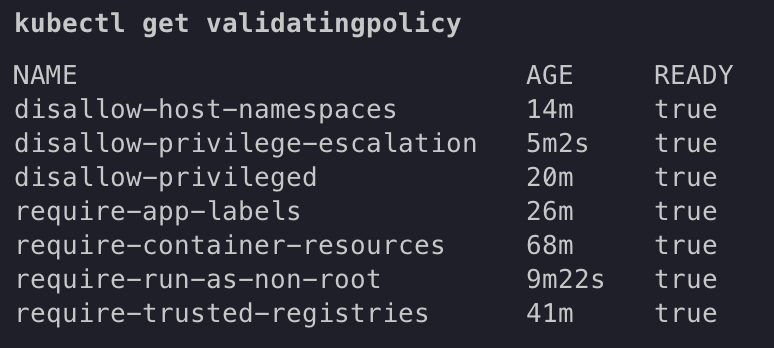

## Часть 2 — Helm-чарт api и worker

Для приложения подготовили Helm-чарт `charts/shop`. Количество реплик, образы, ресурсы и параметры probes описали в `values.yaml`. 
По умолчанию запускаются три реплики `api` и две реплики `worker`.

В шаблоны сразу добавлены требования политик из Части 1:
- CPU и memory `requests`/`limits`;
- стандартные метки `app.kubernetes.io/*`;
- образы из доверенного реестра `ghcr.io`;
- `runAsNonRoot: true`;
- `privileged: false` и `allowPrivilegeEscalation: false`;
- readiness- и liveness-пробы на `/health`.

Перед установкой итоговые манифесты проверели через server-side dry run, поэтому запрос прошёл не только синтаксическую проверку Helm, но и Kyverno.

### Установка чарта
Образы `api:v1` и `worker:v1` собрали локально и импортировали напрямую в
containerd всех нод k3d. Наличия образа только в `docker images` недостаточно, т.к docker daemon хоста и containerd нод имеют разные image stores.
Первый запуск Helm завершился по timeout из-за `ImagePullBackOff`: kubelet не нашёл локальные образы и попытался скачать их из приватного пути GHCR. 
После импорта с `k3d image import --mode direct` Pod'ы запустились, а следующий`helm upgrade --wait` создал успешную ревизию release.

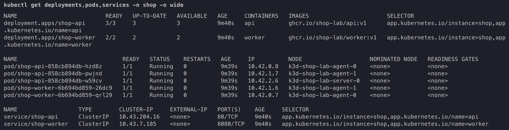

После установки endpoint `/health` отвечал `ok` через Service `shop-api`.

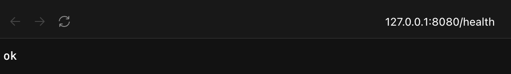

### Reconciliation после удаления Pod
Один Pod `api` удалили вручную. Поле `spec.replicas` при этом не изменилось, поэтому ReplicaSet controller увидел расхождение между desired и actual state и создал замену. 
`pod-template-hash` сохранился, поскольку шаблон Pod не менялся, но случайный суффикс имени нового Pod стал другим.

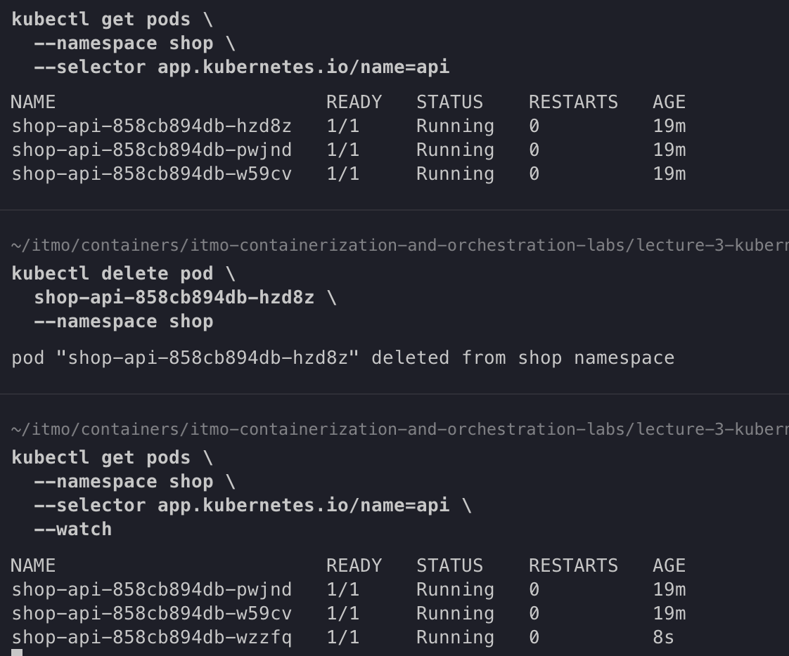

### Масштабирование через Helm

Значение `api.replicaCount` изменили с `3` на `4`, после чего выполнили `helm upgrade`. 
Deployment получил новое желаемое число реплик, а ReplicaSet controller создал четвёртый Pod. 
Service менять не потребовалось: новый Ready Pod автоматически попал в EndpointSlice благодаря совпадающим labels.


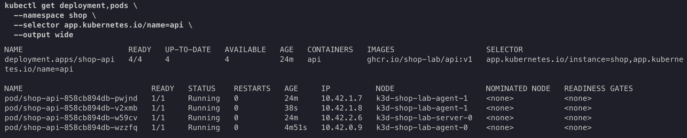

### Rolling update

Для `api` собрали и импортировали образ `ghcr.io/shop-lab/api:v2`, затем тег изменили в `values.yaml`. 
Изменение `spec.template` создало новый ReplicaSet с новым `pod-template-hash`.

Стратегия обновления:

```yaml
rollingUpdate:
  maxUnavailable: 0
  maxSurge: 1
```

Она разрешает создать один дополнительный Pod, но не разрешает уменьшить число доступных реплик. 
Новый Pod попадал в endpoints Service только после успешной readiness-пробы. 
После rollout старый ReplicaSet с образом `v1` был уменьшен до нуля, а новый ReplicaSet с образом `v2` содержал четыре Ready Pod.

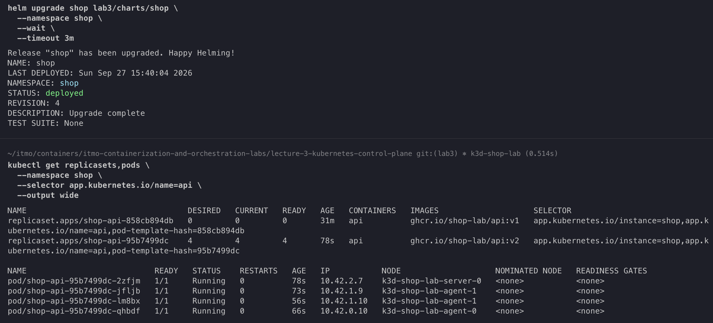

Во время проверки обнаружили ограничение `kubectl port-forward service/...`:
команда выбирала конкретный Pod и теряла соединение, если этот Pod удалялся во время rollout.
Что не означает недоступность Service. 
Для дальнейшей проверки использовали API proxy с явным именем порта Service:

```text
/api/v1/namespaces/shop/services/shop-api:http/proxy/health
```

### Зависший rollout и rollback

Для проверки отказоустойчивости выставили `api.healthFail: true`.
Оно передало контейнеру `HEALTH_FAIL=true`, после чего `/health` начал возвращать HTTP 5xx.

Deployment создал один дополнительный Pod новой ревизии, но его readiness-проба не прошла. 
Из-за `maxSurge: 1` нельзя было создать ещё один Pod, а из-за`maxUnavailable: 0` нельзя было удалить старый Ready Pod. 
Поэтому rollout безопасно остановился в состоянии:

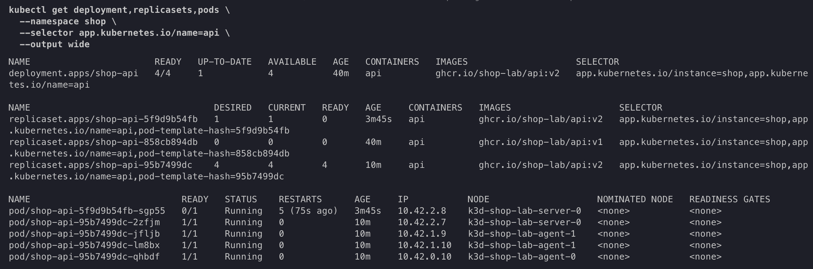

Четыре Pod предыдущей ревизии продолжили обслуживать Service, и проверочные запросы возвращали HTTP 200.
Неготовый Pod оставался `Running`, но имел готовность `0/1`; liveness-проба также перезапускала его контейнер.

`helm upgrade --wait --timeout 90s` завершился ошибкой, однако уже применённые объекты остались в Kubernetes. 
Статус Helm `failed` сам по себе не выполняет откат.

Команда `helm rollback shop 4` применила содержимое последней исправной ревизии как новую ревизию `6`. 
После отката сломанный ReplicaSet уменьшили до нуля, а четыре исправных Pod снова соответствовали текущему шаблону. 
Локальное значение `api.healthFail` отдельно возвращено в `false`, поскольку Helm rollback не редактирует файлы рабочего каталога.

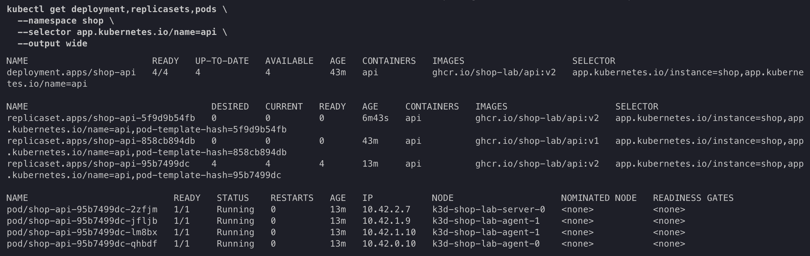

Итоговая история release:

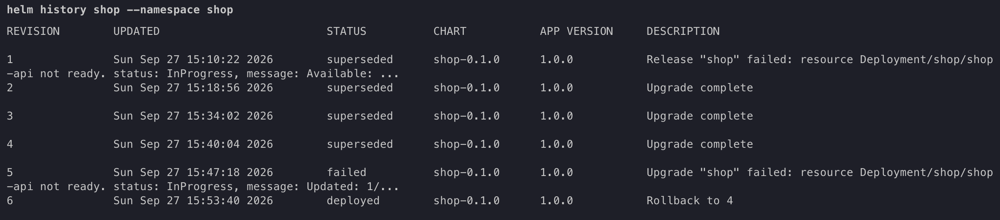

## Часть 3 — PostgreSQL через CloudNativePG

Для управления PostgreSQL выбрали CloudNativePG. Оператор установили отдельно от приложения как Helm release `cnpg`: chart `0.29.1`, operator `1.30.1`. 
Один cluster-level оператор может обслуживать несколько приложений и namespace'ов, поэтому его жизненный цикл не связан с удалением release `shop`.

Для controller Pod оператора задали CPU/memory requests и limits в отдельном файле `platform/cnpg-values.yaml`. 
Первая установка была отклонена Kyverno: Pod template Deployment не содержал обязательные labels `app.kubernetes.io/part-of` и `app.kubernetes.io/managed-by`. 
После добавления их через `podLabels` вторая Helm-ревизия установилась успешно.

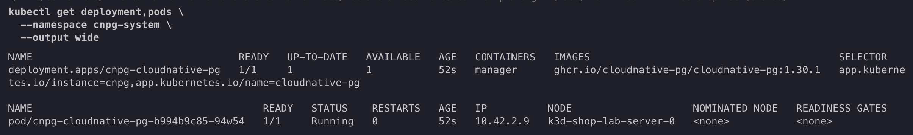

Оператор зарегистрировал CRD `clusters.postgresql.cnpg.io`. 
CRD определяет новый тип Kubernetes-ресурса, `Cluster/shop-postgres`- экземпляр этого типа с желаемым состоянием PostgreSQL.

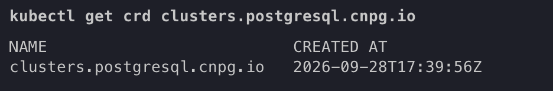

### PostgreSQL-кластер приложения

В chart `shop` добавили:
- Secret `shop-postgres-credentials` для bootstrap-владельца базы;
- объект `Cluster/shop-postgres` с одним инстансом;
- PVC размером `1Gi` через StorageClass `local-path`;
- ресурсы и наследуемые labels для создаваемых оператором объектов.

Одного инстанса достаточно для проверки reconciliation.
StorageClass `local-path` хранит данные на конкретной ноде, поэтому также не защищает данные от потери этой ноды. 
Режим `WaitForFirstConsumer` откладывает создание volume до выбора ноды для Pod.

После применения chart оператор создал PostgreSQL Pod, PVC и сервис записи `shop-postgres-rw`. 
Helm не ждёт готовности произвольного CRD, поэтому результат проверялся по полю `status` объекта `Cluster`, а не только по статусу release.

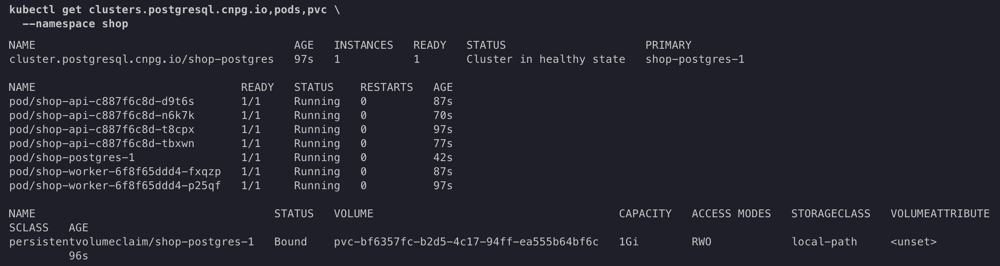

Сокращённый `spec`:

```yaml
spec:
  instances: 1
  inheritedMetadata:
    labels:
      app.kubernetes.io/name: postgres
      app.kubernetes.io/part-of: shop
      app.kubernetes.io/managed-by: cloudnative-pg
  bootstrap:
    initdb:
      database: shop
      owner: shop
      secret:
        name: shop-postgres-credentials
  imageName: ghcr.io/cloudnative-pg/postgresql:18.6-system-trixie
  resources:
    requests:
      cpu: 100m
      memory: 256Mi
    limits:
      cpu: 500m
      memory: 512Mi
  storage:
    size: 1Gi
    storageClass: local-path
```

`spec` описывает желаемое состояние. 
Часть полей добавлена defaulting-механизмом CRD CloudNativePG, поэтому сохранённый объект содержит больше настроек, чем исходный Helm-шаблон.

Сокращённый `status`:

```yaml
status:
  conditions:
    - type: Initialized
      status: "True"
      reason: BootstrapCompleted
    - type: Ready
      status: "True"
      reason: ClusterIsReady
  currentPrimary: shop-postgres-1
  instances: 1
  readyInstances: 1
  healthyPVC:
    - shop-postgres-1
  phase: Cluster in healthy state
  targetPrimary: shop-postgres-1
  writeService: shop-postgres-rw
```

`status` записывает CloudNativePG через отдельный API subresource `/status`. 
Это наблюдаемое состояние, которое не задаётся Helm-шаблоном и не должно редактироваться пользователем вручную.

### Reconciliation после удаления PostgreSQL Pod

Перед удалением Pod `shop-postgres-1` имел UID:

```text
df6f94f4-336b-4007-9d11-bab5a437edc9
```

После `kubectl delete pod` оператор создал новый Pod с тем же логическим именем, но новым UID:

```text
cb511cb8-fcd2-4de7-b347-bf8b68730bf3
```

Изменившийся UID доказывает создание нового Kubernetes-объекта, а не restart контейнера внутри прежнего Pod. 
PVC не удалился, он имеет отдельный жизненный цикл, поэтому новый Pod подключил прежний volume с данными.

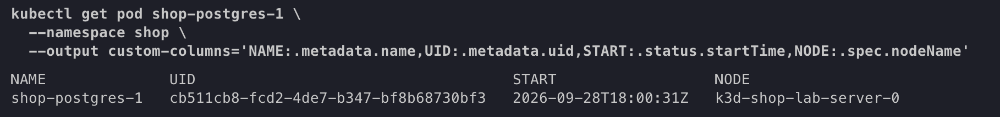

## Часть 4 — Падение control plane

Перед экспериментом через ClusterIP `10.43.204.16` из контейнера agent-ноды проверили `/health`, создание заказа и `/orders`. 
Первый заказ был успешно обработан worker'ом, поэтому работоспособность всей цепочки`API -> PostgreSQL -> worker -> PostgreSQL -> API` была подтверждена.

В односерверном k3d процесс `/bin/k3s server` объединяет API server, scheduler, controller-manager, встроенное хранилище и компоненты agent'а server-ноды. 
В нашем звпуске он имел PID `87`. Чтобы не смешивать отказ control plane с выключением целой ноды, заморозили только этот процесс:

```console
docker exec k3d-shop-lab-server-0 kill -STOP 87
```

`containerd`, сетевое пространство ноды и уже запущенные workload-контейнеры при этом продолжили работать.

### Что отвалилось

API server лег, поэтому чтение и изменение желаемого состояния не проходили:

```text
$ kubectl --request-timeout=5s get nodes
Unable to connect to the server: context deadline exceeded

$ kubectl apply --request-timeout=5s \
    --filename policies/kyverno/01-require-container-resources.yaml
error validating data: failed to download openapi:
Client.Timeout exceeded while awaiting headers
```

Запрос `apply` остановился ещё при загрузке OpenAPI-схемы. 
Он не дошёл до admission и записи в datastore. 
Scheduler и controllers также не могли создавать новые объекты или делать реконнект через API server.

### Что продолжило жить

Проверку выполняли напрямую из контейнера agent-ноды через уже существующий ClusterIP:

```console
docker exec k3d-shop-lab-agent-0 \
  wget -T 5 -qO- http://10.43.204.16/health
```

`/health` продолжил возвращать `ok`. 
Во время отказа создали второй заказ`during-control-plane-outage`, после чего worker изменил его состояние на `processed:true`.

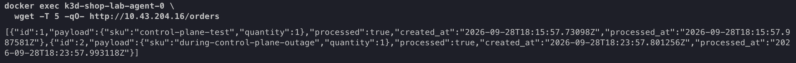

Так получилось потому что после отказа control plane уже запущенные Pod’ы продолжают работать, контейнеры выполняются на нодах под управлением container runtime и kubelet. 
Service также остаётся доступным, потому что правила маршрутизации к текущим Pod’ам уже настроены в dataplane нод. 
При обработке обычного HTTP-запроса обращаться к API server не требуется.
Но кластер больше не может обновлять это состояние. 
Kubelet способен локально перезапустить контейнер внутри существующего Pod, но при удалении Pod`a или отказе ноды для создания замены нужны API server, scheduler и контроллеры. 
Без них новый Pod не создастся, а список эндпоинтов не обновится.

### Восстановление

Тот же процесс продолжили сигналом `SIGCONT`:

```console
docker exec k3d-shop-lab-server-0 kill -CONT 87
```

После восстановления все ноды вернулись в состояние `Ready`, а повторный `kubectl apply` успешно дошёл до API server и сообщил, что политика не изменилась.

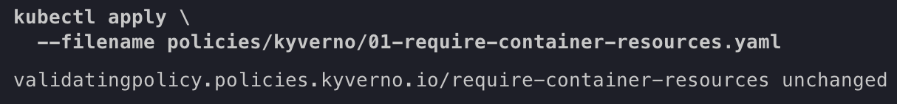

## Часть 5 — Мониторинг и алертинг

Для наблюдаемости повторно использовали платформу из 2 лабы: `kube-prometheus-stack` версии `90.1.1`. 
В namespace `obs` отдельным Helm release `kps` установлены Prometheus Operator, Prometheus, Alertmanager, Grafana, kube-state-metrics и node-exporter.

Добавили `obs` в исключения политик Kyverno, т.к нужны возможности больше, чем обычным workload'ам.
Такое исключение создаёт доверенную зону: права на создание объектов в ней должны быть ограничены RBAC, иначе нехороший человек сможет обойти кластерные требования безопасности.
После изменения исключений тестовый Pod без ресурсов в `policy-tests` по-прежнему отклонялся, соответственно область действия политик для приложений не расширилась.

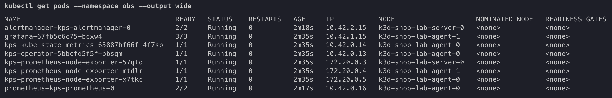

Установка stack зарегистрировала CRD `ServiceMonitor` и `PrometheusRule`.
Prometheus Operator наблюдает эти декларативные ресурсы и преобразует их в runtime-конфигурацию Prometheus; сами CRD не выполняют scrape и не вычисляют алерты.

### Метрики приложения и ServiceMonitor

В `api:v3` добавили endpoint `/metrics` со следующими метриками:
- `shop_api_http_requests_total` — counter запросов с ограниченными labels `method`, `route` и `status`;
- `shop_api_http_request_duration_seconds` — гистограмма длительности запросов.

Фактические URL не используются как label: неизвестные пути сводятся к `route="unmatched"`.

В `worker:v2` экспортируются:
- `shop_worker_orders_processed_total`;
- `shop_worker_processing_errors_total`.

Helm-шаблон `ServiceMonitor` выбирает Service `api` и `worker` release `shop`, обращается к именованному порту `http` по пути `/metrics` каждые 15 секунд.
Поле `jobLabel: app.kubernetes.io/name` формирует отдельные jobs `api` и `worker`. Labels `namespace`, `pod`, `service` добавляются Kubernetes service discovery и relabeling-конфигурацией, которую генерирует Operator.

Prometheus обнаружил четыре API и два worker target; все шесть находились в состоянии `UP`.

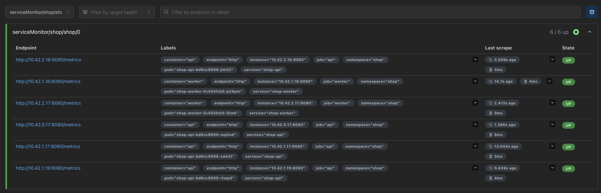

Значение `up=1` подтверждает только успешный scrape `/metrics`. 
Оно не гарантирует работу `/order`, соединение с PostgreSQL или обработку заказа worker'ом, поэтому поверх технической доступности используются прикладные метрики.

### Prometheus правила
В chart добавили `PrometheusRule` с тремя алертами, которые контролируют доступность, ошибки и время ответа API.

#### ShopAPIUnavailable
Срабатывает, если Prometheus не может получить метрики ни от одной реплики API в течение одной минуты. 
Правило учитывает два случая:
- targets существуют, но их метрика `up` равна `0`;
- API targets полностью исчезли из service discovery.
Для второго случая используется `absent()`, потому что сравнение над пустым набором метрик само по себе не создаёт результат и не вызовет алерт.

#### ShopAPIHighErrorRate
Срабатывает, если более 5% бизнес-запросов завершаются ответом 5xx в течение двух минут. 
Используется доля ошибок, а не их абсолютное количество: одинаковое число ошибок имеет разное значение при десяти и десяти тысячах запросов.
Маршруты `/health` и `/metrics` исключили из расчёта, поскольку это технический трафик от Kubernetes probes и Prometheus.

#### ShopAPIHighLatencyP95
Срабатывает, если p95 времени ответа бизнес-маршрутов превышает одну секунду в течение пяти минут.
Для расчёта сначала суммируются бакеты гистограм всех реплик API, а затем вычисляется общий p95. 
Рассчитывать p95 отдельно для каждого Pod и объединять полученные значения нельзя т.к квантили не являются аддитивными.
Параметр `for` во всех правилах не позволяет кратковременному отклонению сразу перевести алерт в состояние `firing`.

`clamp_min` защищает знаменатель error rate от нуля. Отсутствующий ряд ошибок преобразуется через `or vector(0)`: 
Prometheus создаёт label series лениво, поэтому отсутствие наблюдавшихся 5xx означает «ноль ошибок», а не ошибку запроса.

Загрузку правил проверили через HTTP API Prometheus. 
Все три имели `health=ok` и до эксперимента находились в `inactive`.

### Проверка срабатывания алерта
Для контролируемого отказа Deployment `shop-api` мастабировали до нуля. 
После исчезновения targets выражение `ShopAPIUnavailable` стало истинным: алерт перешёл из `inactive` в `pending`, выдержал `for: 1m` и стал `firing`.

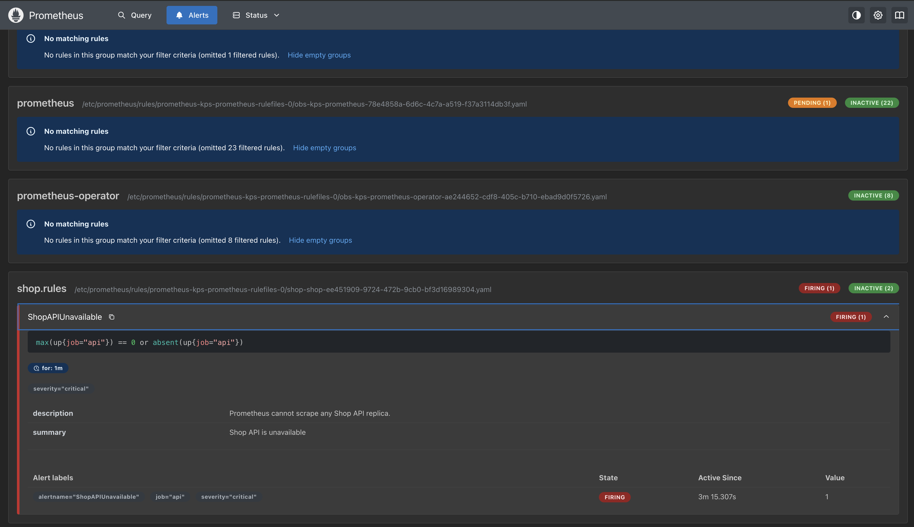

После восстановления четырёх реплик Prometheus на следующем цикле вычисления перевёл алерт обратно в `inactive`, ручное закрытие алерта не требуется.

### Борд в Grafana
Dashboard `Shop — RED + worker` поставляется тем же chart как ConfigMap с лейблом `grafana_dashboard=1`. 

#### Dashboard показывает:
- request rate по нормализованным маршрутам;
- долю HTTP 5xx;
- p50, p95 и p99 длительности запросов;
- число доступных scrape targets API;
- обработанные worker'ом заказы и ошибки обработки за 15 минут.

Для наполнения графиков cоздали 20 заказов и выполнели 30 чтений `/orders`. 
Дробное значение `increase(counter[15m])` допустимо т.к функция экстраполирует прирост между дискретными scrape-сэмплами к границам окна.

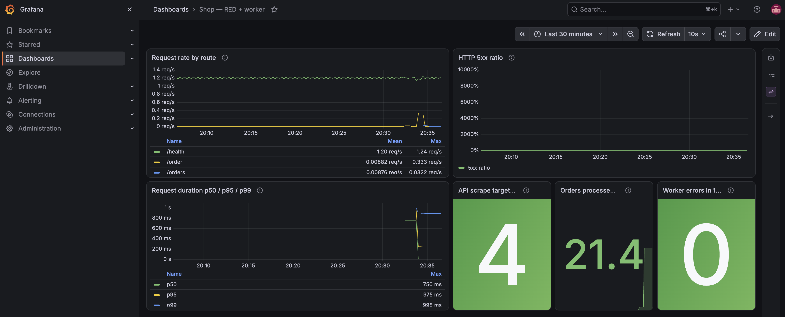
